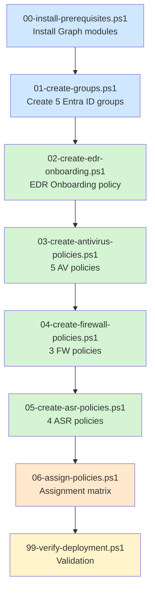

# PowerShell deployment scripts

This directory contains PowerShell scripts to deploy the MDE Foundations baseline via Microsoft Graph. The scripts are designed to be run in order, with optional dry-run mode for validation before applying changes.

## Prerequisites

- PowerShell 7.0 or higher (PowerShell 5.1 is not supported - some Graph SDK cmdlets behave differently)
- Internet access to install Microsoft Graph PowerShell modules
- An Entra ID account with one of the following roles:
  - Global Administrator (for initial deployment)
  - Intune Administrator + Security Administrator (combined)
- MDE tenant initialized
- MDE/Intune connection enabled (see [docs/en/01-prerequisites.md](../docs/en/01-prerequisites.md))

## Required Graph permissions

The scripts request the following delegated permissions on first connection:

- `Group.ReadWrite.All` - create and manage Entra ID groups
- `DeviceManagementConfiguration.ReadWrite.All` - create and manage Intune configuration policies
- `DeviceManagementServiceConfig.ReadWrite.All` - manage Intune service configuration
- `DeviceManagementApps.ReadWrite.All` - read application assignments
- `Policy.ReadWrite.ConditionalAccess` - referenced for consistency, not strictly required by these scripts
- `Directory.Read.All` - read directory information

Consent is requested interactively on first run.

## Execution sequence



## Usage

### Initial setup (once)

```powershell
.\00-install-prerequisites.ps1
```

This installs the required Microsoft Graph PowerShell modules to the current user scope. No tenant connection is made at this stage.

### Deployment

Run scripts in numbered order. Each script begins by connecting to Microsoft Graph if not already connected.

```powershell
.\01-create-groups.ps1
.\02-create-edr-onboarding.ps1
.\03-create-antivirus-policies.ps1
.\04-create-firewall-policies.ps1
.\05-create-asr-policies.ps1
.\06-assign-policies.ps1
```

### Dry-run mode

All scripts support a `-WhatIf` switch to preview changes without applying them.

```powershell
.\01-create-groups.ps1 -WhatIf
```

In dry-run mode, the script lists every action that would be performed (groups created, policies created, assignments applied) but makes no actual changes to the tenant.

### Verification

After deployment, run the verification script to validate the state of the tenant:

```powershell
.\99-verify-deployment.ps1
```

The script checks the existence of expected groups and policies, their settings, and their assignments. A summary is displayed at the end with any inconsistencies detected.

## Customization before execution

Some parameters should be reviewed before running the scripts.

### Naming convention prefixes

In `01-create-groups.ps1`, the dynamic rules for production groups use prefixes (`WRK-`, `SRV-`). Adjust them to match the actual naming convention in the tenant by editing the script header:

```powershell
$WorkstationPrefix = "WRK-"
$ServerPrefix      = "SRV-"
```

### Administration subnets

In `04-create-firewall-policies.ps1`, the server firewall rules reference an administration subnet that must be defined. Adjust the script header:

```powershell
$AdminSubnet = "10.0.0.0/24"
```

### Idempotence

All scripts are idempotent. Running them multiple times does not create duplicates. If a group or policy already exists with the expected name, the script updates it rather than creating a new one.

## Disconnection

After deployment, the Graph session can be terminated explicitly:

```powershell
Disconnect-MgGraph
```

This is not strictly necessary; the session expires automatically.

## Troubleshooting

If a script fails with an authentication error, verify:

- The Graph PowerShell modules are properly installed (`Get-Module Microsoft.Graph -ListAvailable`)
- The connection has been established with the correct scopes
- The account used has the required roles

For Graph-specific errors (HTTP 4xx, 5xx), the script displays the original error message. The most common errors:

| Error | Probable cause |
|---|---|
| `Insufficient privileges` | Missing role or scope not granted |
| `Resource not found` | Reference to an object that does not exist (e.g., a group not yet created) |
| `Conflicting object` | An object with the same name already exists in another scope |

For tenant-side problems (policies that do not apply on devices), see [docs/en/07-troubleshooting.md](../docs/en/07-troubleshooting.md).

## Limitations

A few points to be aware of:

- The scripts use the **Settings Catalog** API for some policies and the **Endpoint Security** API for others, depending on what Microsoft exposes. Some parameter names may differ from those in the Intune admin center UI.
- The Antivirus, Firewall, and ASR policies are created via the Endpoint Security API (`deviceManagement/configurationPolicies`).
- The EDR Onboarding policy uses the Intune Configuration Profile API (specific intent type).
- Firewall rules are created as separate Endpoint Security policies, not as inline rules in a configuration policy.

## License

These scripts are provided under the MIT license, like the rest of the repository.
