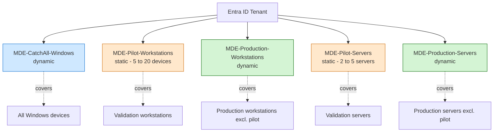
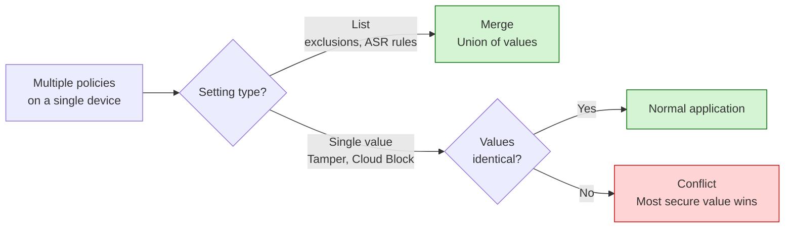
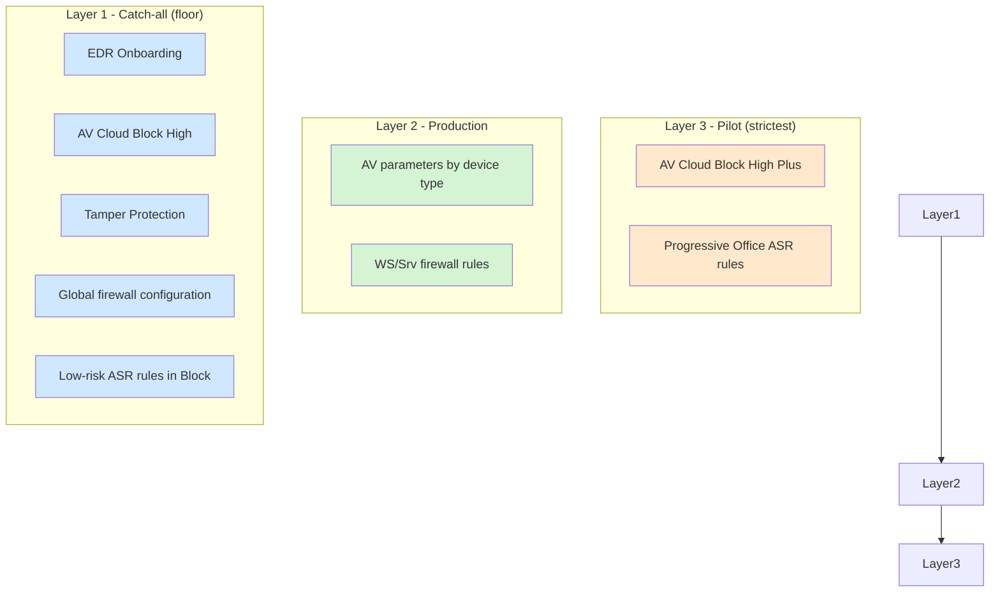
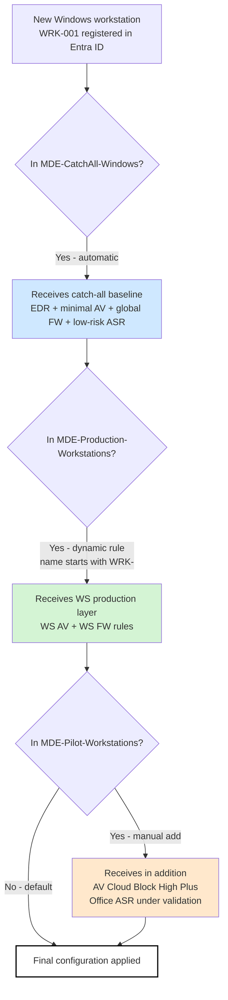

# Architecture

This document describes the structural choices behind the MDE Foundations baseline: group organization, policy layering, and the interaction between them.

## Design principles

The baseline is built on three principles.

**A safety net first.** A catch-all group with non-negotiable minimum settings (active antivirus, Tamper Protection, EDR onboarding) ensures every Windows device in the tenant has a baseline of protection, whether or not it falls into a specific targeting group.

**Layered policies over monolithic ones.** Rather than one large policy per area, the baseline uses small policies that layer on top of each other. The catch-all sets the minimum, production policies add stricter settings, pilot policies add the strictest. This layering relies on the merge behavior of Intune Endpoint Security policies.

**Separation of workstations and servers.** Workstations and servers expose different attack surfaces and have different operational constraints. Their policies are kept distinct from the start, even when settings happen to be identical, to avoid splitting policies later.

## Group structure

Five Entra ID groups, with clear roles.



### Why dynamic for catch-all and production, static for pilots

Catch-all and production groups should be self-maintaining. New devices joining the tenant should automatically receive their policies without manual intervention. That is what dynamic groups provide.

Pilot groups are intentionally managed manually. Adding a device to a pilot group is a deliberate act: it indicates that this device is willing to receive the strictest settings first, in exchange for advance warning of any breaking change.

## Policy layering

Intune Endpoint Security policies merge when multiple policies target the same device.



This behavior is what makes the layered approach safe. The catch-all sets a floor; production policies can only raise the floor, never lower it.

## Policy hierarchy

Three layers stacked from broadest to most restrictive.



## Application flow on a device

Concrete view of what a device receives based on its group membership.



## Assignment matrix

Which policy applies to which group:

| Policy | CatchAll | Pilot WS | Prod WS | Pilot Srv | Prod Srv |
|---|---|---|---|---|---|
| MDE-EDR-Onboarding | ✓ | | | | |
| MDE-AV-CatchAll | ✓ | | | | |
| MDE-AV-Workstations-Production | | | ✓ | | |
| MDE-AV-Servers-Production | | | | | ✓ |
| MDE-AV-Workstations-Pilot | | ✓ | | | |
| MDE-AV-Servers-Pilot | | | | ✓ | |
| MDE-FW-CatchAll | ✓ | | | | |
| MDE-FW-Rules-Workstations | | ✓ | ✓ | | |
| MDE-FW-Rules-Servers | | | | ✓ | ✓ |
| MDE-ASR-LowRisk-Block | ✓ | | | | |
| MDE-ASR-Office-Audit (initial phase) | | ✓ | | | |
| MDE-ASR-Office-Warn (after pilot) | | | ✓ | | |
| MDE-ASR-Office-Block (after Warn) | | | ✓ | | |

## Why no Office ASR policies on servers

ASR rules targeting Office applications (`Block all Office applications from creating child processes`, `Block Win32 API calls from Office macros`, etc.) don't make sense in a typical server context. Servers don't run Office applications under interactive sessions.

Exceptions exist (legacy SharePoint with server-side Office automation), but they are rare and should be handled with dedicated policies, outside the standard baseline.

## Why a single EDR onboarding policy for workstations and servers

The onboarding policy is identical for both: same package, same sample sharing configuration, same telemetry reporting frequency. Splitting it would add complexity without benefit.

Differentiation between workstations and servers happens in subsequent policies (antivirus, firewall, ASR), not in onboarding.

## Naming convention

All policies follow this pattern:

```
MDE-<Category>-<Scope>[-<Subscope>]
```

Examples:

- `MDE-EDR-Onboarding`
- `MDE-AV-CatchAll`
- `MDE-AV-Workstations-Production`
- `MDE-FW-Rules-Servers`
- `MDE-ASR-LowRisk-Block`
- `MDE-ASR-Office-Audit`

This naming makes policies easy to identify, filter, and reason about. Renaming a policy after deployment should be avoided, as it can break documentation references.

## Next steps

- [03-policies-reference.md](03-policies-reference.md) - exhaustive list of every parameter in every policy
- [04-deployment-plan.md](04-deployment-plan.md) - week-by-week deployment calendar
