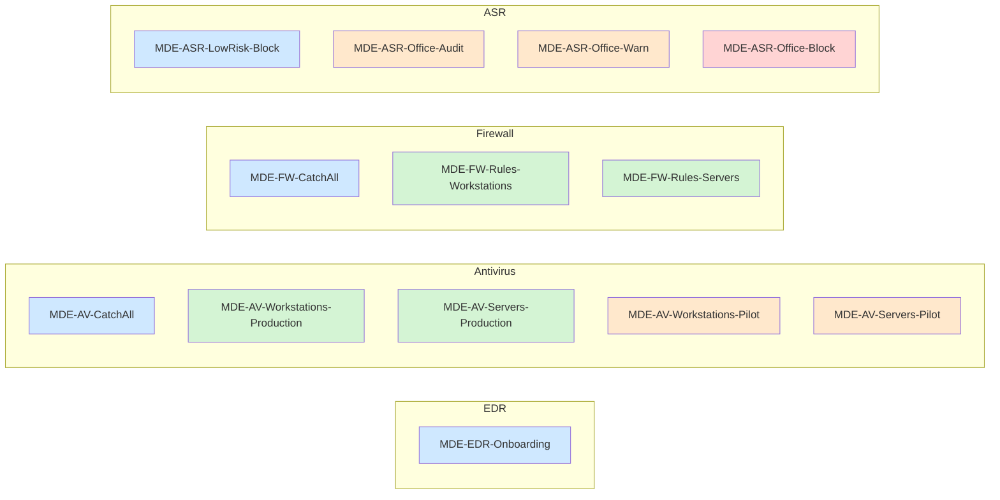
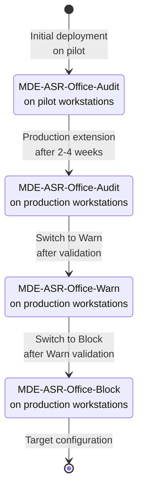

# Policies reference

This document lists exhaustively every parameter of every policy in the MDE Foundations baseline. It serves as a reference for manual deployment and for validating PowerShell scripts.

## Overview



Color code: blue = catch-all baseline, green = production, orange = pilot / intermediate phase, red = final Block phase.

| Category | Policies | Total count |
|---|---|---|
| EDR | MDE-EDR-Onboarding | 1 |
| Antivirus | CatchAll, Workstations-Production, Servers-Production, Workstations-Pilot, Servers-Pilot | 5 |
| Firewall | CatchAll, Rules-Workstations, Rules-Servers | 3 |
| ASR | LowRisk-Block, Office-Audit, Office-Warn, Office-Block | 4 |

Total: 13 policies.

## MDE-EDR-Onboarding

EDR onboarding policy applied to all Windows devices.

### Creation

`Endpoint security > Endpoint detection and response > Create policy`

| Field | Value |
|---|---|
| Platform | Windows 10, Windows 11, and Windows Server |
| Profile | Endpoint detection and response |
| Name | MDE-EDR-Onboarding |

### Parameters

| Parameter | Value |
|---|---|
| Microsoft Defender for Endpoint client configuration package type | Auto from connector |
| Sample sharing | All |
| Telemetry Reporting Frequency | Expedite |

### Assignment

| Group |
|---|
| MDE-CatchAll-Windows |

## MDE-AV-CatchAll

Minimum antivirus baseline applied to all Windows devices.

### Creation

`Endpoint security > Antivirus > Create policy`

| Field | Value |
|---|---|
| Platform | Windows 10, Windows 11, and Windows Server |
| Profile | Microsoft Defender Antivirus |
| Name | MDE-AV-CatchAll |

### Parameters - Real-time protection

| Parameter | Value |
|---|---|
| Allow Realtime Monitoring | Allowed |
| Allow Behavior Monitoring | Allowed |
| Allow IOAV Protection | Allowed |
| Allow Script Scanning | Allowed |
| Allow On Access Protection | Allowed |
| Real Time Scan Direction | Monitor all files (bi-directional) |

### Parameters - Cloud protection

| Parameter | Value |
|---|---|
| Allow Cloud Protection | Allowed |
| Cloud Block Level | High |
| Cloud Extended Timeout | 50 |
| Submit Samples Consent | Send safe samples automatically |

### Parameters - Scans

| Parameter | Value |
|---|---|
| Allow Archive Scanning | Allowed |
| Allow Email Scanning | Allowed |
| Allow Full Scan On Mapped Network Drives | Not Allowed |
| Allow Scanning Network Files | Not Allowed |
| Disable Catchup Quick Scan | Disabled |
| Disable Catchup Full Scan | Disabled |

### Parameters - Security

| Parameter | Value |
|---|---|
| Tamper Protection | Enabled |
| Disable Local Admin Merge | Disabled |
| Days To Retain Cleaned Malware | 30 |
| Disable Auto Exclusions | Not Configured |

### Assignment

| Group |
|---|
| MDE-CatchAll-Windows |

### Notes

No exclusions at this level. Specific exclusions should live in dedicated policies, justified, and reviewed every six months.

## MDE-AV-Workstations-Production

Workstation-specific antivirus layer. Inherits from the catch-all and adds user-oriented parameters.

### Creation

| Field | Value |
|---|---|
| Platform | Windows 10, Windows 11, and Windows Server |
| Profile | Microsoft Defender Antivirus |
| Name | MDE-AV-Workstations-Production |

### Parameters

| Parameter | Value |
|---|---|
| Scan Parameter | Full scan |
| Schedule Scan Day | Saturday |
| Schedule Quick Scan Time | 720 (12:00) |
| Schedule Scan Time | 120 (02:00) |
| Avg CPU Load Factor | 25 |
| Disable CPU Throttle On Idle Scans | Disabled |
| Check For Signatures Before Running Scan | Enabled |
| Signature Update Interval | 4 |

### Assignment

| Group |
|---|
| MDE-Production-Workstations |

## MDE-AV-Servers-Production

Server-specific antivirus layer.

### Creation

| Field | Value |
|---|---|
| Platform | Windows 10, Windows 11, and Windows Server |
| Profile | Microsoft Defender Antivirus |
| Name | MDE-AV-Servers-Production |

### Parameters

| Parameter | Value |
|---|---|
| Scan Parameter | Quick scan |
| Schedule Scan Day | Sunday |
| Schedule Quick Scan Time | 180 (03:00) |
| Avg CPU Load Factor | 10 |
| Disable CPU Throttle On Idle Scans | Disabled |
| Disable Auto Exclusions | Not Configured |
| Allow On Access Protection | Allowed |

### Assignment

| Group |
|---|
| MDE-Production-Servers |

### Notes

Server role automatic exclusions (Exchange, SQL Server, AD DS, IIS, Hyper-V) are applied automatically on Windows Server 2016 and later as long as `Disable Auto Exclusions` remains `Not Configured` or `Disabled`.

## MDE-AV-Workstations-Pilot

Strictest antivirus layer, applied to pilot workstations to identify false positives before production rollout.

### Creation

| Field | Value |
|---|---|
| Platform | Windows 10, Windows 11, and Windows Server |
| Profile | Microsoft Defender Antivirus |
| Name | MDE-AV-Workstations-Pilot |

### Parameters

| Parameter | Value |
|---|---|
| Cloud Block Level | High Plus |

### Assignment

| Group |
|---|
| MDE-Pilot-Workstations |

## MDE-AV-Servers-Pilot

Server equivalent of the workstation pilot policy.

### Creation

| Field | Value |
|---|---|
| Platform | Windows 10, Windows 11, and Windows Server |
| Profile | Microsoft Defender Antivirus |
| Name | MDE-AV-Servers-Pilot |

### Parameters

| Parameter | Value |
|---|---|
| Cloud Block Level | High Plus |

### Assignment

| Group |
|---|
| MDE-Pilot-Servers |

## MDE-FW-CatchAll

Global Windows firewall configuration applied to all Windows devices.

### Creation

`Endpoint security > Firewall > Create policy`

| Field | Value |
|---|---|
| Platform | Windows 10, Windows 11, and Windows Server |
| Profile | Microsoft Defender Firewall |
| Name | MDE-FW-CatchAll |

### Parameters - Domain profile

| Parameter | Value |
|---|---|
| Enable Firewall | True |
| Default Inbound Action | Block |
| Default Outbound Action | Allow |
| Disable Unicast Responses To Multicast Broadcast Traffic | False |
| Disable Stealth Mode | False |
| Disable Stealth Mode IPsec Secured Packet Exemption | False |
| Allow Local Policy Merge | False |
| Allow Local IPsec Policy Merge | False |
| Disable Inbound Notifications | False |

### Parameters - Private profile

Same values as Domain profile.

### Parameters - Public profile

Same values as Domain profile.

### Assignment

| Group |
|---|
| MDE-CatchAll-Windows |

### Notes

For servers, a copy of this policy can be created with `Disable Inbound Notifications = True` (no interactive user popup needed on a server without interactive session).

## MDE-FW-Rules-Workstations

Workstation-specific firewall rules.

### Creation

`Endpoint security > Firewall > Create policy`

| Field | Value |
|---|---|
| Platform | Windows 10, Windows 11, and Windows Server |
| Profile | Microsoft Defender Firewall Rules |
| Name | MDE-FW-Rules-Workstations |

### Rules

**Block-Outbound-SMB-Internet**

| Parameter | Value |
|---|---|
| Direction | Outbound |
| Action | Block |
| Protocol | TCP |
| Remote ports | 445 |
| Remote addresses | Internet (predefined group) |
| Profiles | Domain, Private, Public |
| Description | Prevents outbound SMB lateral movement to Internet |

**Block-Outbound-Legacy-Protocols**

| Parameter | Value |
|---|---|
| Direction | Outbound |
| Action | Block |
| Protocol | TCP |
| Remote ports | 21, 23, 69 |
| Profiles | Domain, Private, Public |
| Description | Blocks outbound Telnet, FTP, and TFTP |

**Block-Inbound-RDP-Public**

| Parameter | Value |
|---|---|
| Direction | Inbound |
| Action | Block |
| Protocol | TCP |
| Local ports | 3389 |
| Profiles | Public |
| Description | Prevents inbound RDP on Public profile (cafe, airport) |

**Allow-Inbound-ICMPv4-Echo-Domain**

| Parameter | Value |
|---|---|
| Direction | Inbound |
| Action | Allow |
| Protocol | ICMPv4 |
| ICMP Type | 8 (Echo Request) |
| Profiles | Domain |
| Description | Allows inbound ping on Domain profile for monitoring |

### Assignment

| Group |
|---|
| MDE-Pilot-Workstations |
| MDE-Production-Workstations |

## MDE-FW-Rules-Servers

Server-specific firewall rules.

### Creation

| Field | Value |
|---|---|
| Platform | Windows 10, Windows 11, and Windows Server |
| Profile | Microsoft Defender Firewall Rules |
| Name | MDE-FW-Rules-Servers |

### Rules

**Block-Inbound-SMB-Internet**

| Parameter | Value |
|---|---|
| Direction | Inbound |
| Action | Block |
| Protocol | TCP |
| Local ports | 445 |
| Remote addresses | Internet |
| Profiles | Domain, Private, Public |
| Description | Blocks inbound SMB from Internet |

**Block-Inbound-RDP-Public-Servers**

| Parameter | Value |
|---|---|
| Direction | Inbound |
| Action | Block |
| Protocol | TCP |
| Local ports | 3389 |
| Profiles | Public |
| Description | Blocks RDP on Public profile in case of unintended profile switch |

**Allow-Inbound-RDP-Admin-Subnet**

| Parameter | Value |
|---|---|
| Direction | Inbound |
| Action | Allow |
| Protocol | TCP |
| Local ports | 3389 |
| Remote addresses | To configure: admin subnet |
| Profiles | Domain |
| Description | Allows RDP from admin subnet only |

**Allow-Inbound-WinRM-Admin-Subnet**

| Parameter | Value |
|---|---|
| Direction | Inbound |
| Action | Allow |
| Protocol | TCP |
| Local ports | 5985, 5986 |
| Remote addresses | To configure: admin subnet |
| Profiles | Domain |
| Description | Allows WinRM from admin subnet only |

### Assignment

| Group |
|---|
| MDE-Pilot-Servers |
| MDE-Production-Servers |

### Notes

Application-specific rules for server roles (IIS on 443, SQL Server on 1433, Exchange SMTP/IMAP/HTTPS) should live in dedicated per-role policies, not in the common baseline.

## MDE-ASR-LowRisk-Block

Low-risk ASR rules, activatable directly in Block mode.

### Creation

`Endpoint security > Attack surface reduction > Create policy`

| Field | Value |
|---|---|
| Platform | Windows 10, Windows 11, and Windows Server |
| Profile | Attack Surface Reduction Rules |
| Name | MDE-ASR-LowRisk-Block |

### Rules

| Rule | GUID | State |
|---|---|---|
| Block credential stealing from LSASS | 9e6c4e1f-7d60-472f-ba1a-a39ef669e4b2 | Block |
| Block abuse of exploited vulnerable signed drivers | 56a863a9-875e-4185-98a7-b882c64b5ce5 | Block |
| Block persistence through WMI event subscription | e6db77e5-3df2-4cf1-b95a-636979351e5b | Block |
| Block execution of potentially obfuscated scripts | 5beb7efe-fd9a-4556-801d-275e5ffc04cc | Block |
| Block JavaScript or VBScript from launching downloaded executable content | d3e037e1-3eb8-44c8-a917-57927947596d | Block |
| Block executable content from email client and webmail | be9ba2d9-53ea-4cdc-84e5-9b1eeee46550 | Block |
| Block untrusted and unsigned processes that run from USB | b2b3f03d-6a65-4f7b-a9c7-1c7ef74a9ba4 | Block |
| Block executable files from running unless they meet a prevalence, age, or trusted list criterion | 01443614-cd74-433a-b99e-2ecdc07bfc25 | Block |
| Use advanced protection against ransomware | c1db55ab-c21a-4637-bb3f-a12568109d35 | Block |

### Assignment

| Group |
|---|
| MDE-CatchAll-Windows |

### Notes

The LSASS rule has been Block-by-default since 2022. It does not support Warn mode and includes internal filtering to reduce false positives. If LSA Protection is enabled at Windows level, the ASR rule is classified as "Not Applicable".

## MDE-ASR-Office-Audit

Office ASR rules in Audit mode to identify impacted business workflows.

### Creation

| Field | Value |
|---|---|
| Platform | Windows 10, Windows 11, and Windows Server |
| Profile | Attack Surface Reduction Rules |
| Name | MDE-ASR-Office-Audit |

### Rules

| Rule | GUID | State |
|---|---|---|
| Block all Office applications from creating child processes | d4f940ab-401b-4efc-aadc-ad5f3c50688a | Audit |
| Block Office applications from creating executable content | 3b576869-a4ec-4529-8536-b80a7769e899 | Audit |
| Block Office applications from injecting code into other processes | 75668c1f-73b5-4cf0-bb93-3ecf5cb7cc84 | Audit |
| Block Win32 API calls from Office macros | 92e97fa1-2edf-4476-bdd6-9dd0b4dddc7b | Audit |
| Block Adobe Reader from creating child processes | 7674ba52-37eb-4a4f-a9a1-f0f9a1619a2c | Audit |

### Assignment

Initial phase: `MDE-Pilot-Workstations`

Phase 2 (after pilot validation): add `MDE-Production-Workstations`

## MDE-ASR-Office-Warn

Same rules as above in Warn mode, except `Block Win32 API calls from Office macros` which does not support Warn.

### Creation

| Field | Value |
|---|---|
| Platform | Windows 10, Windows 11, and Windows Server |
| Profile | Attack Surface Reduction Rules |
| Name | MDE-ASR-Office-Warn |

### Rules

| Rule | GUID | State |
|---|---|---|
| Block all Office applications from creating child processes | d4f940ab-401b-4efc-aadc-ad5f3c50688a | Warn |
| Block Office applications from creating executable content | 3b576869-a4ec-4529-8536-b80a7769e899 | Warn |
| Block Office applications from injecting code into other processes | 75668c1f-73b5-4cf0-bb93-3ecf5cb7cc84 | Warn |
| Block Win32 API calls from Office macros | 92e97fa1-2edf-4476-bdd6-9dd0b4dddc7b | Audit |
| Block Adobe Reader from creating child processes | 7674ba52-37eb-4a4f-a9a1-f0f9a1619a2c | Warn |

### Assignment

| Group |
|---|
| MDE-Production-Workstations |

### Notes

The `Block Win32 API calls from Office macros` rule stays in Audit because it does not support Warn. It will move to Block in the `MDE-ASR-Office-Block` policy.

## MDE-ASR-Office-Block

Same rules in Block mode, after full validation of the Warn phase.

### Creation

| Field | Value |
|---|---|
| Platform | Windows 10, Windows 11, and Windows Server |
| Profile | Attack Surface Reduction Rules |
| Name | MDE-ASR-Office-Block |

### Rules

| Rule | GUID | State |
|---|---|---|
| Block all Office applications from creating child processes | d4f940ab-401b-4efc-aadc-ad5f3c50688a | Block |
| Block Office applications from creating executable content | 3b576869-a4ec-4529-8536-b80a7769e899 | Block |
| Block Office applications from injecting code into other processes | 75668c1f-73b5-4cf0-bb93-3ecf5cb7cc84 | Block |
| Block Win32 API calls from Office macros | 92e97fa1-2edf-4476-bdd6-9dd0b4dddc7b | Block |
| Block Adobe Reader from creating child processes | 7674ba52-37eb-4a4f-a9a1-f0f9a1619a2c | Block |

### Assignment

| Group |
|---|
| MDE-Production-Workstations |

### Notes

This policy replaces `MDE-ASR-Office-Warn` after the Warn observation phase. Both policies should not coexist on the same group (risk of Conflict on simple-value settings).

## Tenant-level configuration

A few settings to enable in the Microsoft Defender portal, independent of Intune policies.

### Tamper Protection (tenant level)

`security.microsoft.com > Settings > Endpoints > Advanced features > Tamper Protection`

State: Enabled

### Automated Investigation

`security.microsoft.com > Settings > Endpoints > Advanced features > Automated Investigation`

State: Enabled. Recommended initial mode: Semi (manual validation of remediations).

### Live Response for Servers

`security.microsoft.com > Settings > Endpoints > Advanced features > Live Response for Servers`

State: Enabled (requires MDE P2).

### Allow or block file

`security.microsoft.com > Settings > Endpoints > Advanced features > Allow or block file`

State: Enabled. Allows manual file blocking by hash from the portal.

## Dynamic group rules summary

Dynamic group membership rules are configured in the Entra ID portal.

### MDE-CatchAll-Windows

```
(device.deviceOSType -eq "Windows")
```

### MDE-Production-Workstations

```
(device.deviceOSType -eq "Windows") 
and (device.deviceOSVersion -notStartsWith "10.0.17763")
and (device.deviceOSVersion -notStartsWith "10.0.20348")
and (device.displayName -startsWith "WRK-")
```

To be adapted to the naming convention and Windows Server versions present in the fleet.

### MDE-Production-Servers

```
(device.deviceOSType -eq "Windows") 
and (device.displayName -startsWith "SRV-")
```

To be adapted to the naming convention.

### Pilot groups

Static membership. No dynamic rule.

## Cycle of ASR Office rules



See [04-deployment-plan.md](04-deployment-plan.md) for the detailed calendar.

## Important notes

Some parameters documented here require validation in a real environment before large-scale adoption:

- **Avg CPU Load Factor**, **Signature Update Interval**, **Days To Retain Cleaned Malware**: reasonable values proposed, to confirm based on context
- **GUID of the "Block executable files unless prevalence..." rule**: rule with specific behavior, validation recommended in Audit mode before Block
- **Dynamic Entra ID rules based on deviceOSVersion**: OS versions must be adapted to the actual fleet
- **Exact parameter naming in Intune**: Microsoft occasionally adapts parameter names between admin center versions. Names may slightly differ at deployment time.
