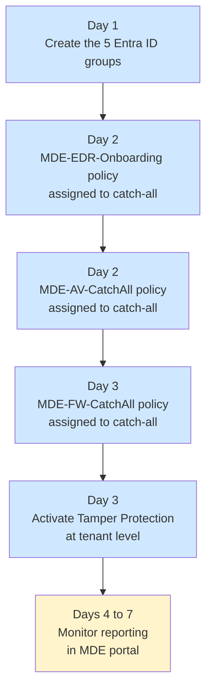
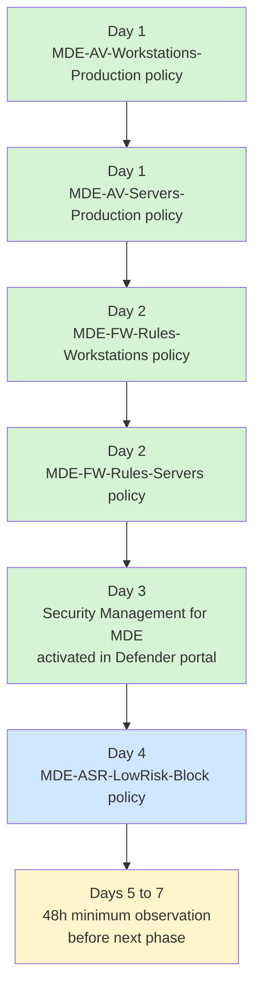
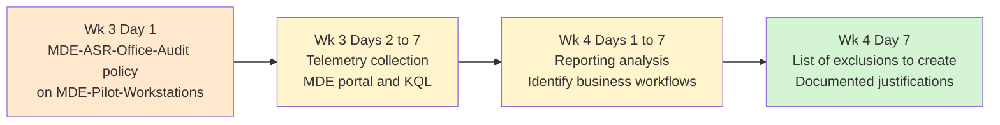
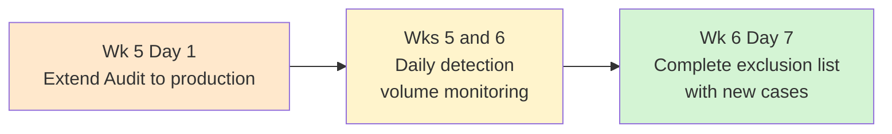
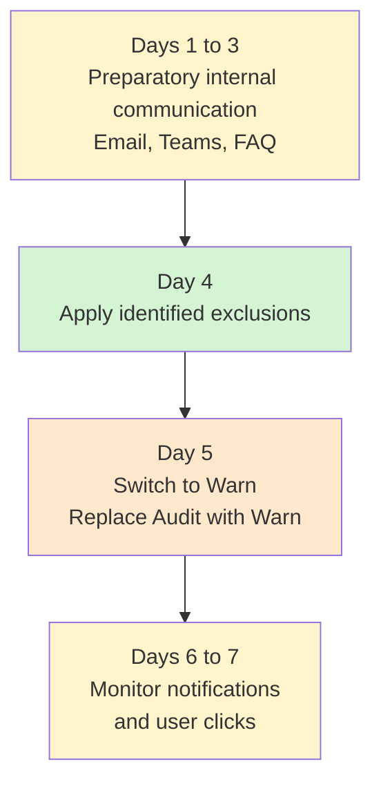
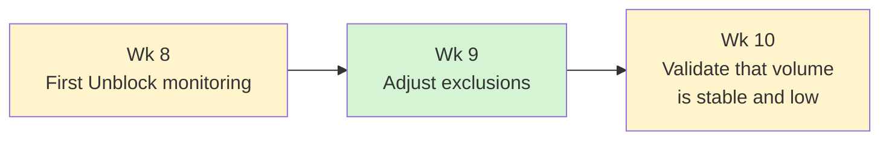
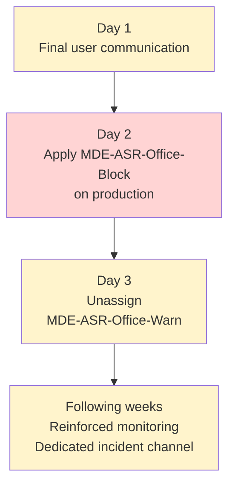

# Deployment plan

This document describes the deployment sequence for the MDE Foundations baseline over an eleven-week period. Durations are indicative and should be adapted to fleet size and observed reporting volume.

## Progressive deployment principles

The baseline is not deployed all at once. Three reasons for this.

**Incident isolation**: by deploying in waves, the cause of any application incident is easier to trace. If a dozen policies are activated on the same day, isolating the responsible one takes significantly more work.

**Audit phase for impactful rules**: some ASR rules require extended observation before effective blocking. Activating directly in Block mode without audit means discovering business impacts in production.

**Validation before extension**: each layer is first tested on the pilot group before extension to production. Unexpected behavior on five pilot workstations is manageable; the same on 500 production workstations is not.

## Calendar overview

```mermaid
gantt
    title MDE Foundations deployment calendar
    dateFormat X
    axisFormat Wk %s

    section Baseline
    Create Entra ID groups            :done, g1, 0, 3
    EDR Onboarding policy             :done, e1, 3, 2
    AV Catch-all policy               :done, a1, 5, 2
    FW Catch-all policy               :done, f1, 7, 2
    Tenant Tamper Protection          :done, t1, 9, 1

    section Production
    Workstation AV/FW policies        :active, p1, 7, 5
    Server AV/FW policies             :active, p2, 7, 5
    Security Management for MDE       :active, sm, 7, 3
    ASR Low Risk Block                :active, ar, 9, 5

    section ASR Office Audit
    Audit on pilot                    :asr1, 14, 14
    Audit on production               :asr2, 28, 21

    section ASR Office Warn
    User preparation                  :prep, 42, 7
    Warn on production                :asr3, 49, 21

    section ASR Office Block
    Block on production               :asr4, 70, 7
    Reinforced monitoring             :surv, 77, 14
```



Note: x-axis units are relative days (Week 1 = days 0 to 7, Week 2 = days 7 to 14, etc.).

## Phase 1 - Baseline setup (Week 1)

Creation of Entra ID groups and activation of catch-all policies.

### Steps



### Validation points

At the end of Week 1, verify:

- The five Entra ID groups are created and their dynamic rules work correctly
- Windows devices appear in the MDE portal with `Active` status
- Tamper Protection appears as `Enabled` on a sample of workstations (PowerShell verification)
- No mass application incident reporting in Intune (`Error` or `Conflict` statuses on policies)

See [05-verification.md](05-verification.md) for verification commands.

## Phase 2 - Production deployment (Week 2)

Extension of the baseline to workstation and server production groups, plus Security Management for MDE activation.

### Steps



### Validation points

At the end of Week 2, verify:

- Production policies are applied on devices in the corresponding groups (`Success` status)
- Any `Conflict` statuses are traced and understood (generally none if policies are well constructed)
- Devices outside Intune but onboarded in MDE receive policies via Security Management for MDE
- No application incident reporting related to the LSASS ASR rule or other low-risk rules

## Phase 3 - ASR Office Audit on pilot (Weeks 3 and 4)

First real-world confrontation of ASR Office rules in passive mode (Audit).

### Steps



### Telemetry analysis

During this phase, monitor the dashboard `security.microsoft.com > Reports > Attack surface reduction rules` daily.

For each Audit detection, determine:

- Is the triggering process legitimate?
- Is the process path stable (not in a temporary folder)?
- Is the trigger recurrent or occasional?
- Does the process belong to an identified business application?

Recurrent legitimate processes lead to a per-rule (not global) ASR exclusion documented in the exclusion registry.

### Validation points

At the end of Week 4, the list of justified exclusions for Office rules must be finalized and documented:

| ASR Rule | Excluded process | Justification | Requester | Review date |
|---|---|---|---|---|

## Phase 4 - Extended ASR Office Audit (Weeks 5 and 6)

Extension of the Audit phase to production workstations to capture workflows not present on the pilot.

### Steps

Add `MDE-Production-Workstations` to the assignment of `MDE-ASR-Office-Audit`.



### Validation points

At the end of Week 6, the Audit detection volume should be stable (no new workflows identified for several days). If not, extend the Audit phase by one to two weeks.

## Phase 5 - Preparation and Warn switch (Week 7)

User communication and switch of ASR Office rules to Warn mode.

### Steps



### User communication

Warn mode causes a user popup on detection. Without preparation, this generates support calls. Prepare:

- A communication email to pilot and production workstation users
- A dedicated incident reporting channel (mailbox, Teams)
- A short FAQ explaining the popup appearance

The key message: the popup is a security signal, the user can click Unblock for 24 hours if they have a legitimate need, but each unblock is traced.

### Validation points

At the end of Week 7, verify the Warn policy is correctly applied and that initial popups appear on workstations with triggering workflows.

## Phase 6 - Warn observation (Weeks 8 to 10)

Critical observation phase. Warn reports capture the last cases not identified in Audit.

### Steps



### Monitoring Unblock click count

KQL query to track user clicks in Warn mode:

```kql
DeviceEvents
| where Timestamp > ago(7d)
| where ActionType has "WarnBypassed"
| summarize Count = count() by DeviceName, ActionType, FileName
| order by Count desc
```

If a high volume is observed on a few specific processes, create targeted exclusions rather than reverting to Audit.

### Block switch criteria

The switch to Block is validated when the following criteria are met:

- Weekly Unblock click volume is low (less than a few dozen across the entire fleet)
- Remaining triggering processes are identified and handled (exclusion or business refusal)
- No new workflow has appeared for at least a week

If any criterion is not met, extend the Warn phase by one week.

## Phase 7 - Block switch (Week 11 and beyond)

Definitive switch to blocking mode.

### Steps



### Important

Do not let `MDE-ASR-Office-Warn` and `MDE-ASR-Office-Block` coexist on the same group. This generates conflicts on simple-value ASR rule settings. Unassignment of the Warn policy must immediately follow application of the Block policy.

### Post-switch monitoring

For two weeks following the Block switch, monitor daily:

- Volume of Block detections in the ASR dashboard
- Number of user incident reports via the dedicated channel
- Any `Conflict` statuses appearing in Intune

Any anomalous peak should be analyzed and result in either an additional exclusion or a temporary return to Warn for the application concerned.

## Tracking dashboard

A simple tracking table to maintain over the weeks:

| Phase | Week | Status | Switch date | Notable incidents |
|---|---|---|---|---|
| 1 - Baseline | 1 | | | |
| 2 - Production | 2 | | | |
| 3 - ASR Office Audit pilot | 3 and 4 | | | |
| 4 - ASR Office Audit production | 5 and 6 | | | |
| 5 - Preparation and Warn switch | 7 | | | |
| 6 - Warn observation | 8 to 10 | | | |
| 7 - Block switch | 11 | | | |

## Next steps

Once initial deployment is complete:

- [05-verification.md](05-verification.md) - PowerShell and portal verifications
- [06-customization.md](06-customization.md) - adapting to a specific context
- [07-troubleshooting.md](07-troubleshooting.md) - resolving common issues
