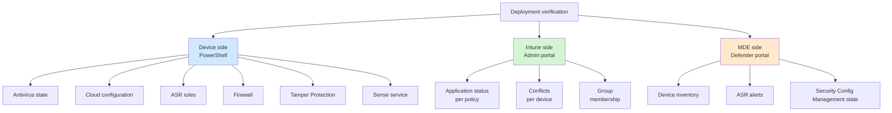
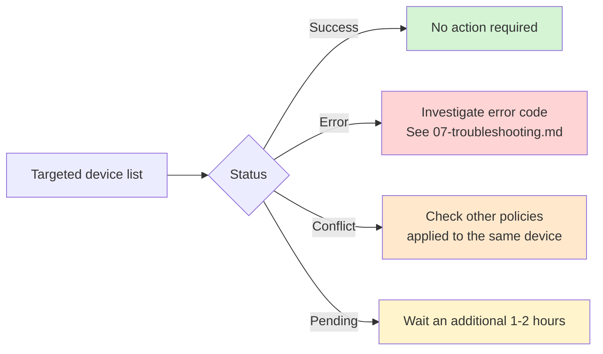
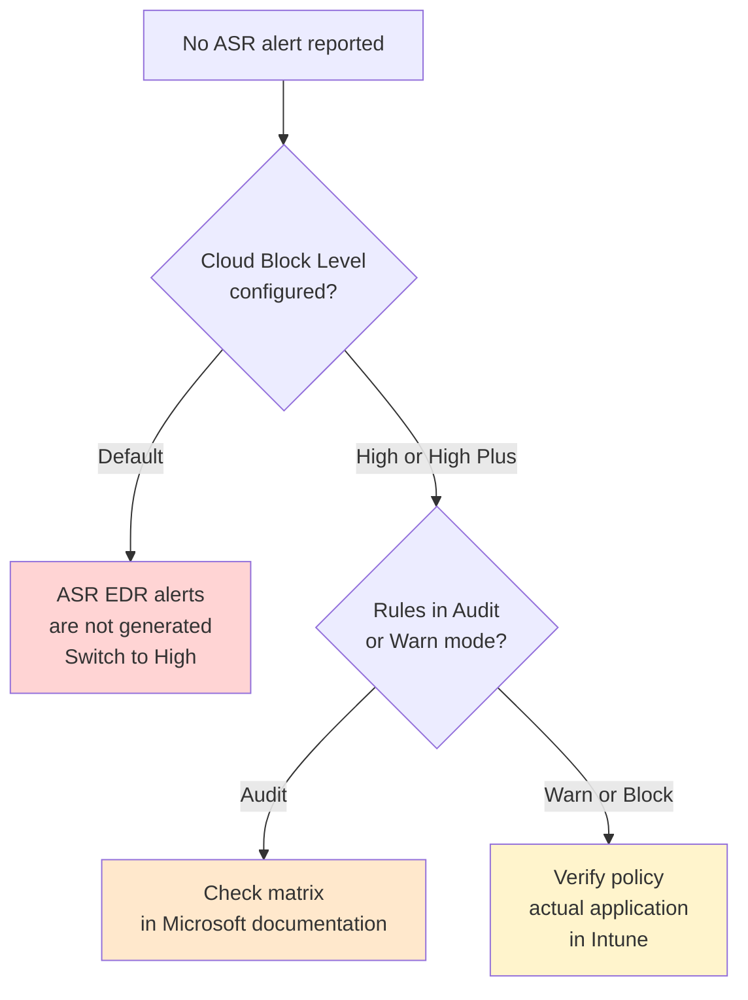

# Deployment verification

This document lists the commands and views to use to verify that an MDE Foundations deployment has been correctly applied on target devices.

## Verification points overview



## Device-side verifications

All commands below must be run from a PowerShell session as local administrator on the target device.

### Overall antivirus state

```powershell
Get-MpComputerStatus | Select-Object -Property `
    AMRunningMode, `
    AntivirusEnabled, `
    RealTimeProtectionEnabled, `
    IsTamperProtected, `
    OnboardingState, `
    AMServiceEnabled, `
    BehaviorMonitorEnabled, `
    IoavProtectionEnabled, `
    OnAccessProtectionEnabled
```

Expected values:

| Property | Expected value |
|---|---|
| AMRunningMode | Normal |
| AntivirusEnabled | True |
| RealTimeProtectionEnabled | True |
| IsTamperProtected | True |
| OnboardingState | 1 |
| AMServiceEnabled | True |
| BehaviorMonitorEnabled | True |
| IoavProtectionEnabled | True |
| OnAccessProtectionEnabled | True |

Any different value indicates a configuration issue to investigate.

### Cloud protection configuration

```powershell
Get-MpPreference | Select-Object -Property `
    MAPSReporting, `
    CloudBlockLevel, `
    CloudExtendedTimeout, `
    SubmitSamplesConsent, `
    DisableBlockAtFirstSeen
```

Expected values:

| Property | Expected value | Meaning |
|---|---|---|
| MAPSReporting | 2 (Advanced) | Cloud protection enabled |
| CloudBlockLevel | 4 (High) or 6 (High Plus) | Cloud blocking level |
| CloudExtendedTimeout | 50 | Cloud response wait time |
| SubmitSamplesConsent | 1 | Automatic safe sample submission |
| DisableBlockAtFirstSeen | False | Block at First Sight enabled |

### ASR rules

```powershell
Get-MpPreference | Select-Object -Property `
    AttackSurfaceReductionRules_Ids, `
    AttackSurfaceReductionRules_Actions, `
    AttackSurfaceReductionOnlyExclusions
```

The output lists configured rule GUIDs and their corresponding state:

| Action | Rule state |
|---|---|
| 0 | Not Configured / Disabled |
| 1 | Block |
| 2 | Audit |
| 6 | Warn |

For easier reading, cross-reference with the GUID table in [03-policies-reference.md](03-policies-reference.md).

### Firewall state

```powershell
Get-NetFirewallProfile -PolicyStore ActiveStore | Select-Object -Property `
    Name, `
    Enabled, `
    DefaultInboundAction, `
    DefaultOutboundAction, `
    AllowLocalPolicyMerge, `
    AllowLocalIPsecPolicyMerge
```

Expected values for each of the three profiles (Domain, Private, Public):

| Property | Expected value |
|---|---|
| Enabled | True |
| DefaultInboundAction | Block |
| DefaultOutboundAction | Allow |
| AllowLocalPolicyMerge | False |
| AllowLocalIPsecPolicyMerge | False |

List active firewall rules inherited from Intune:

```powershell
Get-NetFirewallRule -PolicyStore ActiveStore | Where-Object { 
    $_.PolicyStoreSource -like "*Intune*" 
} | Select-Object DisplayName, Direction, Action, Enabled
```

### Tamper Protection test

Attempt a modification that should be blocked by Tamper Protection:

```powershell
Set-MpPreference -DisableRealtimeMonitoring $true
```

The command returns without visible error, but the value should not be applied. Verification:

```powershell
Get-MpPreference | Select-Object DisableRealtimeMonitoring
```

Expected value: `False`. If the value changed to `True`, Tamper Protection is not effective.

In the Windows event log, the blocked attempt event:

```powershell
Get-WinEvent -LogName "Microsoft-Windows-Windows Defender/Operational" | `
    Where-Object { $_.Id -eq 5004 } | `
    Select-Object -First 5 TimeCreated, Message
```

Event ID `5004` corresponds to a modification attempt blocked by Tamper Protection.

### Sense service (on Windows Server 2012 R2 and 2016)

```powershell
Get-Service -Name Sense | Select-Object Status, StartType
```

Expected values:

| Property | Expected value |
|---|---|
| Status | Running |
| StartType | Automatic |

If `Status` is `Stopped`, check the logs at:

```
C:\ProgramData\Microsoft\Windows Defender Advanced Threat Protection\Logs\
```

## Intune-side verifications

### Application status per policy

`intune.microsoft.com > Endpoint security > [policy type] > [policy name] > Device status`

For each policy, the device list and their status:



### Conflicts per device

`intune.microsoft.com > Devices > [target device] > Device configuration`

If a `Conflict` status appears:

1. Identify the exact conflicting parameter (detailed view shows it)
2. List all policies applied to the device
3. Identify which is pushing a different value
4. Decide: adjust one of the policies, or remove the one that should no longer apply

### Group membership verification

`intune.microsoft.com > Groups > [group name] > Members`

For dynamic groups:

- Verify the member count matches expectations
- Click "Validate rules" to test the dynamic rule against a specific device

### Security Management for MDE state

`intune.microsoft.com > Tenant administration > Connectors and tokens > Microsoft Defender for Endpoint`

Verify the connection is `Active` and that the security management feature from the Defender portal is checked.

## Defender portal verifications

### Device inventory

`security.microsoft.com > Assets > Devices`

Filter by status:

- `Active`: onboarded device sending telemetry
- `Inactive`: onboarded device without recent telemetry (more than 7 days)
- `Misconfigured`: incomplete configuration, see device details

For devices managed via Security Management for MDE, they appear with `Managed by MDE` in the `Managed by` column.

### ASR alerts

`security.microsoft.com > Reports > Attack surface reduction rules`

View by rule and by device over the selected period. Available filters:

- Rule state (Audit, Warn, Block)
- Rule name
- Device or user
- Date range

If no ASR alert appears while rules are configured:



### Onboarding state via the console

`security.microsoft.com > Settings > Endpoints > Device management > Onboarding status`

Overview of onboarded devices and their method (Intune, GPO, local script, MDE Security Config Management).

## Advanced Hunting verifications

A few useful KQL queries to verify deployment at scale.

### Devices without active Tamper Protection

```kql
DeviceInfo
| where Timestamp > ago(7d)
| summarize arg_max(Timestamp, *) by DeviceName
| where OnboardingStatus == "Onboarded"
| where IsTamperProtected == false
| project DeviceName, OSPlatform, OSVersion, LastSeen = Timestamp
```

Any device returned by this query should be investigated.

### Devices with non-compliant Cloud Block Level

```kql
DeviceInfo
| where Timestamp > ago(7d)
| summarize arg_max(Timestamp, *) by DeviceName
| where OnboardingStatus == "Onboarded"
| extend CloudBlockLevel = tostring(MdatpDeviceInfo.CloudBlockLevel)
| where CloudBlockLevel != "High" and CloudBlockLevel != "HighPlus"
| project DeviceName, OSPlatform, CloudBlockLevel
```

### ASR detections per rule over the last 30 days

```kql
DeviceEvents
| where Timestamp > ago(30d)
| where ActionType startswith "Asr"
| summarize Count = count() by ActionType
| order by Count desc
```

### Devices in Audit on Office rules for more than 60 days

```kql
DeviceEvents
| where Timestamp > ago(60d)
| where ActionType startswith "AsrOffice" and ActionType endswith "Audited"
| summarize FirstSeen = min(Timestamp), LastSeen = max(Timestamp) by DeviceName
| where FirstSeen < ago(60d)
```

This query identifies devices left in Audit mode on Office rules for too long. Audit mode is not a target configuration.

## Final validation checklist

After full deployment, validate all of the following.

### Infrastructure side

- [ ] The five Entra ID groups are created and their dynamic rules are functional
- [ ] All baseline policies are deployed (13 policies total)
- [ ] Assignments match the assignment matrix
- [ ] Tamper Protection is enabled at tenant level
- [ ] Security Management for MDE is enabled if needed
- [ ] Automated Investigation is in Semi mode

### Device side (sampling)

On at least three workstations and two servers:

- [ ] Antivirus in Normal mode with real-time protection active
- [ ] Tamper Protection active and modification test blocked
- [ ] Cloud Block Level at High (or High Plus for pilots)
- [ ] Firewall active on all three profiles with expected values
- [ ] Catch-all ASR rules configured
- [ ] Sense service running
- [ ] OnboardingState at 1

### Portal side

- [ ] No persistent `Error` status on policies (beyond 48h)
- [ ] `Conflict` statuses are traced and explained
- [ ] Devices correctly appear in the MDE inventory
- [ ] First ASR alerts appear in the dashboard (catch-all in Block)

## Next steps

- [06-customization.md](06-customization.md) - adapting the baseline to a specific context
- [07-troubleshooting.md](07-troubleshooting.md) - resolving common issues
