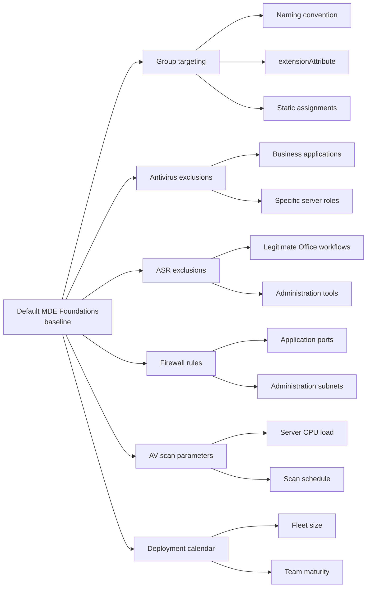
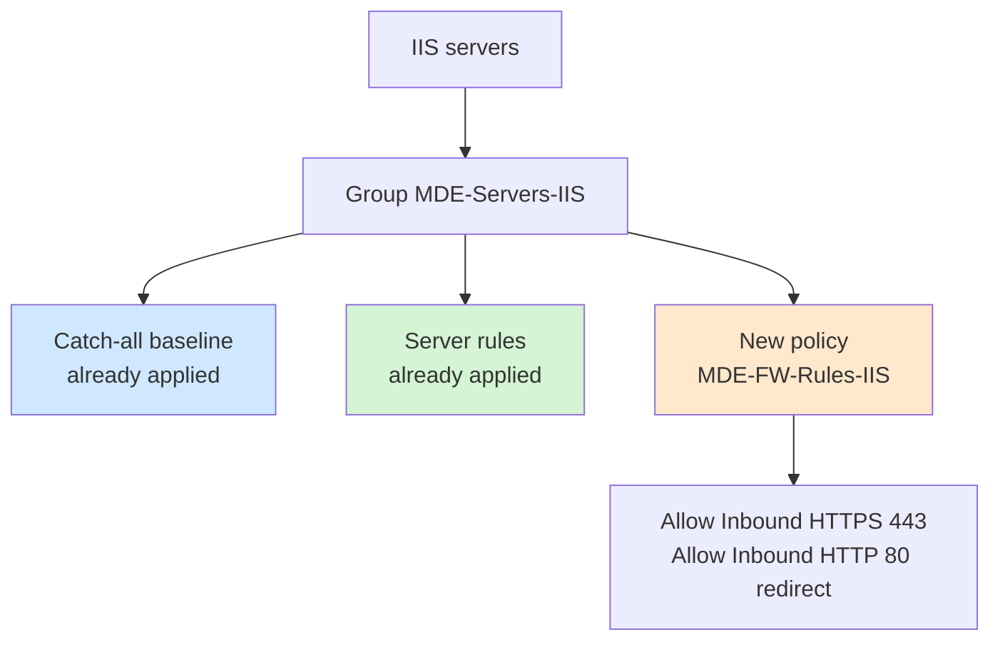

# Customization

The MDE Foundations baseline is a starting point. This document lists adaptation axes for specific contexts: different naming convention, particular server scope, business applications, regulatory requirements.

## Possible customization axes



## Group targeting adaptation

Default dynamic rules rely on a name prefix (`WRK-`, `SRV-`). Several alternatives exist.

### Different naming convention

If the existing naming convention uses other prefixes, adapt dynamic rules accordingly:

```
(device.deviceOSType -eq "Windows") 
and (device.displayName -startsWith "LAP-")
```

or with multiple accepted prefixes:

```
(device.deviceOSType -eq "Windows") 
and (
    (device.displayName -startsWith "WRK-") 
    or (device.displayName -startsWith "LAP-") 
    or (device.displayName -startsWith "DT-")
)
```

### Using extensionAttribute

In the absence of a usable naming convention, use an `extensionAttribute` synchronized from Active Directory.

Step 1: on computer objects in Active Directory, populate an attribute (e.g., `extensionAttribute1`) with a value identifying the device type:

```powershell
# For a workstation
Set-ADComputer -Identity "WRK-001" -Replace @{extensionAttribute1="Workstation"}

# For a server
Set-ADComputer -Identity "SRV-001" -Replace @{extensionAttribute1="Server"}
```

Step 2: Entra Connect synchronizes this attribute to Entra ID at the next sync cycle.

Step 3: adapt the dynamic rule of the production group:

```
(device.deviceOSType -eq "Windows") 
and (device.extensionAttribute1 -eq "Workstation")
```

### Transitional static assignments

If neither naming convention nor extensionAttribute is immediately available, switch production groups to static during the transition. To avoid long-term as manual maintenance of assignments always eventually drifts.

## Business antivirus exclusions

The baseline defines no antivirus exclusions. Exclusions should live in dedicated policies, not in generic ones.

### Creating a dedicated exclusion policy

For each business application requiring exclusions, create a dedicated Antivirus policy:

| Field | Value |
|---|---|
| Name | MDE-AV-Exclusions-{ApplicationName} |
| Profile | Microsoft Defender Antivirus |
| Parameters | Only exclusions, nothing else |
| Assignment | Group targeting only affected machines |

### Exclusion discipline

Each exclusion must have:

- Documented justification (ticket, application request, vendor recommendation)
- Scheduled review every six months
- Narrowest possible scope (precise path rather than parent folder)
- A Process type rather than Path when possible

The exclusion registry to maintain:

| Application | Type | Value | Justification | Requester | Creation date | Review date |
|---|---|---|---|---|---|---|

### Exclusions to absolutely avoid

Regardless of business context, certain exclusions are almost always problematic:

- `C:\Program Files\*`
- `C:\Windows\Temp\*`
- `C:\Users\*\AppData\Local\Temp\*`
- Generic extensions (`.exe`, `.dll`, `.ps1`)
- Entire network shares

If such exclusions are requested, escalate to the application vendor: it's rarely a real necessity.

## ASR exclusions

ASR exclusions work differently from antivirus exclusions. Always use per-rule exclusions (`ASR Only Per Rule Exclusions` parameter), never global.

### Per-rule ASR exclusion structure

Format: `{Rule GUID}|{Process path}`

Example to exclude a business process from the `Block all Office applications from creating child processes` rule:

```
d4f940ab-401b-4efc-aadc-ad5f3c50688a|C:\Program Files\BusinessApp\BusinessApp.exe
```

### ASR exclusion policy

Create a dedicated policy:

| Field | Value |
|---|---|
| Name | MDE-ASR-Exclusions |
| Profile | Attack Surface Reduction Rules |
| Parameter | ASR Only Per Rule Exclusions |
| Assignment | All groups requiring the exclusion |

## Additional firewall rules

The baseline lays down basic rules. For application-specific rules (IIS, SQL Server, Exchange, business applications on custom ports), create dedicated firewall policies per role or per application.

### Example: rules for an IIS server



The `MDE-Servers-IIS` group is static or dynamic depending on the organization. The `MDE-FW-Rules-IIS` policy contains only rules specific to the IIS role, in addition to the existing baseline.

## Antivirus parameters for high I/O load environments

On servers with intensive I/O load (databases, file servers, hypervisors), default parameters may impact performance.

### Adjustable parameters

| Parameter | Baseline default value | Adjusted value for high I/O environment |
|---|---|---|
| Avg CPU Load Factor | 10 (servers) | 5 to 10 |
| Schedule Quick Scan Time | 03:00 | Low activity period |
| Disable CPU Throttle On Idle Scans | Disabled | Disabled (do not disable throttling) |
| Real Time Scan Direction | Bi-directional | Incoming only on file servers |

### Important

Never disable real-time protection to gain performance. This option should be avoided in all cases. If load is really problematic, use targeted exclusions by database path or application process, after validation with the application vendor.

## Deployment calendar

The eleven-week calendar is calibrated for a fleet of several hundred heterogeneous workstations. Some adaptation guidance.

### Very small or homogeneous fleet

On a fleet of fewer than 50 workstations with homogeneous usage, some observation phases can be shortened. The rule remains: do not skip a phase, but observation duration may be halved.

### Very large or very heterogeneous fleet

On a fleet of more than 1000 workstations with significant business variations, observation phases must be extended. More exclusions need identifying, and the volume of Audit reports requires more analysis time.

### Security team maturity

If the team is new to MDE and its operation, plan a skill ramp-up period before the ASR Office phase. Audit mode generates volume to analyze: without prior experience, the phase can stall.

## Special cases

### Developer workstations

Developer workstations have atypical usage (compilation, execution of unsigned binaries, scripts). They trigger more ASR rules.

Recommended approach:

- Create a dedicated `MDE-Developers-Workstations` group
- Deploy standard AV and FW policies to it
- For ASR Office, use Warn mode rather than Block on this group (assuming developers are warned and capable of unblocking a false positive knowingly)
- Maintain an exclusion list specific to development tools used

### Hyper-V virtualization servers

Hyper-V hypervisors automatically apply role-related exclusions. Verify that `Disable Auto Exclusions` remains `Not Configured` or `Disabled` on these servers.

If explicit exclusion management is preferred for audit reasons, disable Auto Exclusions and manually reproduce the list documented by Microsoft for Hyper-V.

### Domain controllers

Domain controllers are particularly sensitive servers. Some recommendations:

- Assign domain controllers to the `MDE-Pilot-Servers` group even in production, to benefit from High Plus Cloud Block Level and quickly identify any suspicious behavior
- Verify that AD DS role automatic exclusions are correctly applied
- Enable Live Response on these servers (requires MDE P2)
- Define a priority investigation procedure in case of EDR alert

### Regulated environments (health, finance, defense)

For environments subject to strong regulatory requirements, several adjustments:

- Disable `Disable Auto Exclusions` to manage all exclusions explicitly and auditably
- Configure `Submit Samples Consent` to `Never send` or `Always prompt` depending on data classification
- Track all policy changes in an independent registry
- Schedule quarterly configuration reviews rather than semi-annual

## Next steps

- [07-troubleshooting.md](07-troubleshooting.md) - resolving common issues
