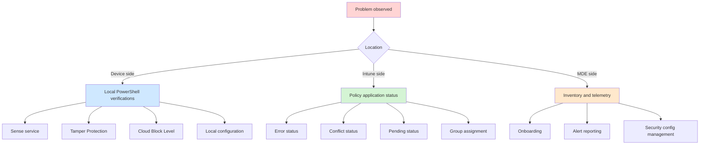
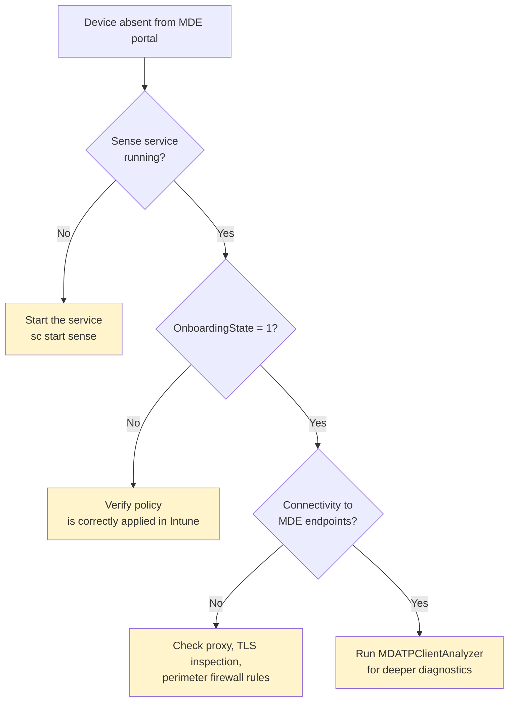
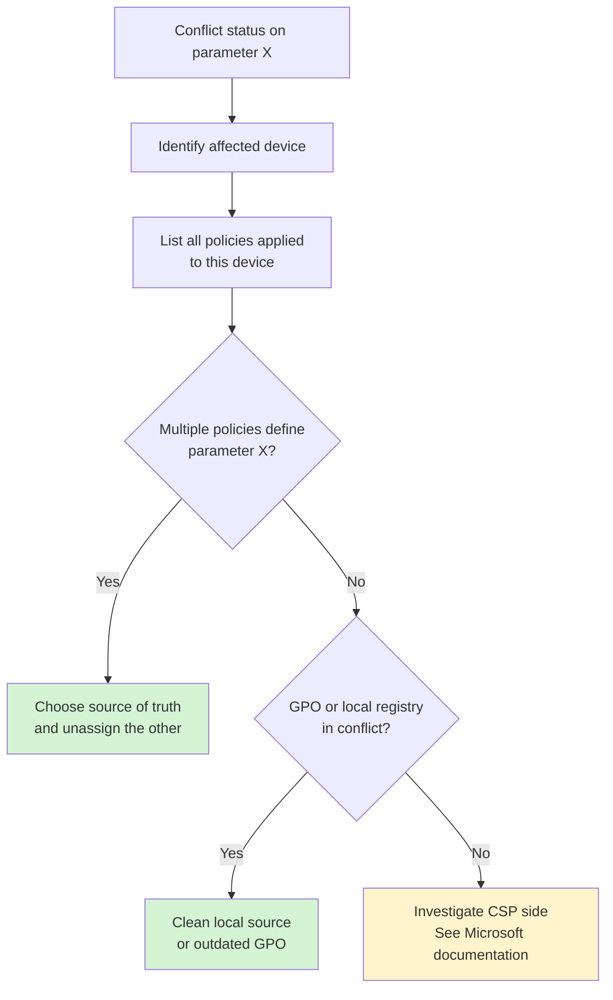
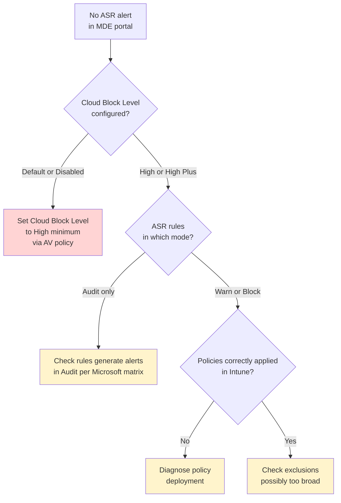
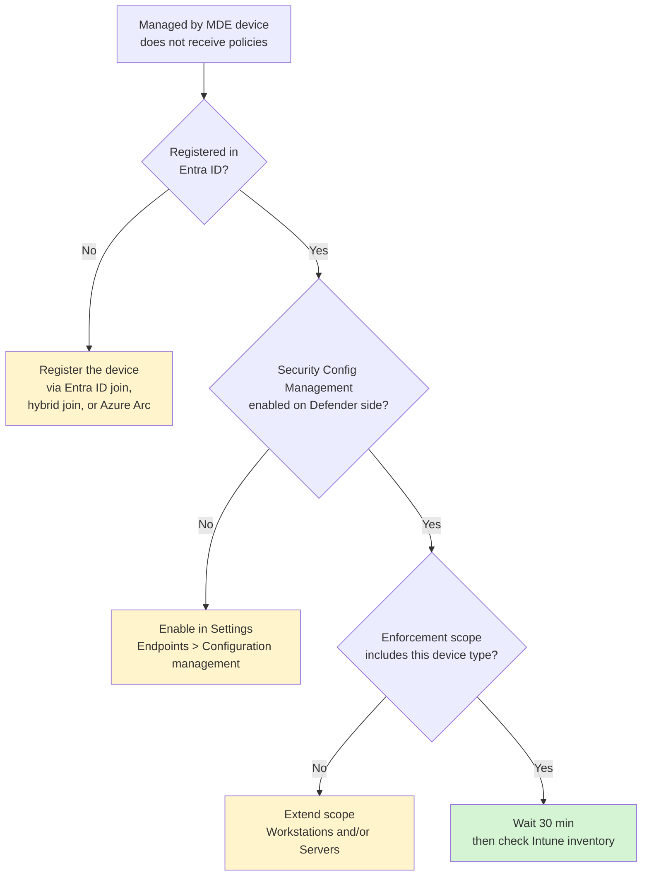
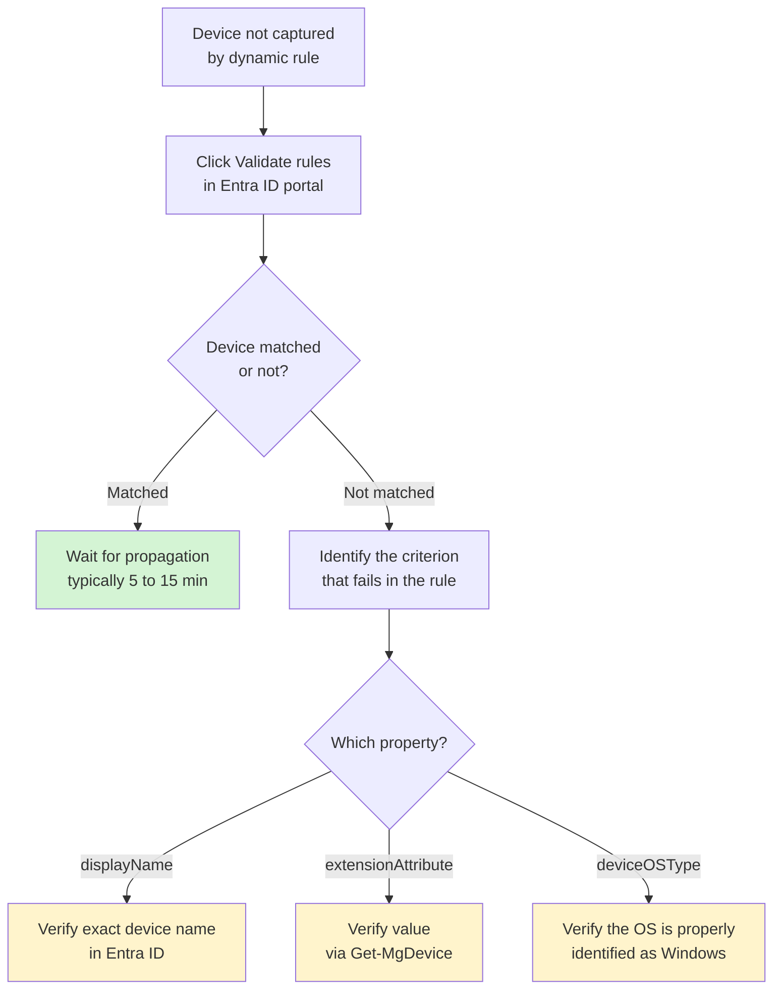

# Troubleshooting

This document lists common problems encountered during deployment and operation of the MDE Foundations baseline, with associated resolution approaches.

## General decision tree



## Onboarding problems

### Symptom: device does not appear in MDE after more than one hour



### Diagnostic commands

Sense service status:

```powershell
Get-Service -Name Sense
sc query sense
```

Onboarding state:

```powershell
Get-MpComputerStatus | Select-Object OnboardingState, AMRunningMode
```

Detailed logs:

```
C:\ProgramData\Microsoft\Windows Defender Advanced Threat Protection\Logs\
```

Official diagnostic tool: `MDATPClientAnalyzer`, downloadable from `security.microsoft.com > Settings > Endpoints > Troubleshooting`.

## Policy application problems

### Symptom: Error status on a policy in Intune

Clicking the Error status opens the error detail with a code. Most common codes:

| Code | Meaning | Resolution |
|---|---|---|
| `0x87D1FDE8` | Remediation conflict | Identify the competing policy and unassign |
| `0x87D101F7` | Setting not supported on OS | Verify OS compatibility for the parameter |
| `0x87D101F4` | MDM communication failure | Force a sync from the device |
| `0x87D1B57C` | Conflicting policy source | Verify absence of conflicting GPO or registry |

Force a sync from the device:

```powershell
# Manual MDM sync
Start-Process "C:\Windows\System32\DeviceEnroller.exe" -ArgumentList "/c","/AutoEnrollMDM"

# Or via the Intune-specific command
Get-ScheduledTask -TaskName "*PushLaunch*" | Start-ScheduledTask
```

### Symptom: recurring Conflict status on a parameter



### Symptom: prolonged Pending status

If a policy remains in `Pending` status beyond 24h:

- Verify the device communicates correctly with Intune (`dsregcmd /status`)
- Force an MDM sync
- Restart the device if necessary
- Verify the device is in the group targeted by the policy (dynamic membership possibly not yet evaluated)

## Catch-all and layering specific problems

### Symptom: a device does not receive the catch-all

Possible causes:

- Device is not registered in Entra ID (workgroup workstation, domain-only server without hybrid join)
- The `MDE-CatchAll-Windows` dynamic rule has not yet evaluated the device (typical delay: 5 to 15 minutes)
- Device is on a non-Windows OS (`deviceOSType -eq "Windows"` filter)

Verification: `intune.microsoft.com > Groups > MDE-CatchAll-Windows > Members`

### Symptom: a device receives the catch-all but not the production layer

Possible causes:

- Device name does not match the expected prefix (`WRK-`, `SRV-`)
- The `extensionAttribute` used in the dynamic rule is not populated or not synced
- Device is in the pilot group, which may or may not be intended

Group membership verification:

```powershell
# Via Microsoft Graph PowerShell
Connect-MgGraph -Scopes "GroupMember.Read.All", "Directory.Read.All"
$device = Get-MgDevice -Filter "displayName eq 'WRK-001'"
Get-MgDeviceMemberOf -DeviceId $device.Id
```

## ASR problems

### Symptom: no ASR alert reports in the portal



### Symptom: persistent false positive on an ASR rule

Four-step approach:

1. Identify the triggering process via MDE portal or KQL
2. Verify process legitimacy (path, signature, application context)
3. Create a per-rule (not global) exclusion with documented justification
4. Monitor for one week after exclusion addition

Identification KQL:

```kql
DeviceEvents
| where Timestamp > ago(7d)
| where DeviceName == "WRK-001"
| where ActionType startswith "Asr"
| project Timestamp, ActionType, FileName, FolderPath, InitiatingProcessFileName, InitiatingProcessCommandLine
| order by Timestamp desc
```

### Symptom: LSASS rule classified as "Not Applicable"

Expected case if Windows-level LSA Protection is enabled. Protection is equivalent, but carried by Windows rather than by MDE.

Verification:

```powershell
# Check LSA Protection state
Get-ItemProperty -Path "HKLM:\SYSTEM\CurrentControlSet\Control\Lsa" -Name "RunAsPPL" -ErrorAction SilentlyContinue
```

Value 1 or 2 = LSA Protection active.

## Tamper Protection problems

### Symptom: Tamper Protection does not activate despite the policy

Verifications in order of probability:

1. The Antivirus policy containing `Tamper Protection = Enabled` is correctly applied (`Success` status)
2. Tenant-level activation is ON in the Defender portal
3. No third-party antivirus is blocking activation
4. Device is correctly onboarded in MDE (without onboarding, Tamper Protection does not apply)

### Symptom: modification test not blocked

If after policy application, `Set-MpPreference -DisableRealtimeMonitoring $true` effectively changes the value:

- Verify `Get-MpComputerStatus | Select-Object IsTamperProtected` (must be `True`)
- Verify Tamper Protection state on the device in the Defender portal
- Force an MDM sync
- If the problem persists, open a Microsoft Support ticket

## Security Management for MDE problems

### Symptom: a device onboarded in MDE does not receive Intune policies despite absence of Intune license



### Security Config Management state verification

`security.microsoft.com > Settings > Endpoints > Configuration management > Onboarded devices`

The device must appear with `MDE` status in the `Management channel` column. If status is `MEM`, the device is enrolled in standard Intune and does not pass through Security Config Management.

## Entra ID dynamic group problems

### Symptom: the dynamic rule does not capture certain devices



### Dynamic rule propagation delay

Typical delays:

- First calculation after rule creation: up to 60 minutes
- Evaluation following a device modification: 5 to 15 minutes
- Exceptional cases (heavily loaded tenants): up to several hours

If the delay exceeds 24h, open a Microsoft Support ticket.

## Incident recovery

### Quick policy deactivation

In case of major application incident related to an MDE Foundations policy:

1. Identify the responsible policy via the status of affected devices
2. In Intune, unassign the concerned group(s) (immediate action)
3. Wait 30 minutes for propagation
4. Diagnose the cause without pressure
5. Reintroduce the policy with the necessary correction

### Restoring an accidentally deleted policy

Intune does not maintain a version history of policies. In case of accidental deletion:

1. The policy must be recreated from documentation
2. IntuneManagement exports or Graph JSON exports serve as reference
3. The Intune audit log (`Tenant administration > Audit logs`) helps identify who did what and when

This is why regular configuration exports via IntuneManagement are valuable, as a backup independent of the tenant.

## External resources

- [Microsoft Defender for Endpoint Troubleshooting](https://learn.microsoft.com/defender-endpoint/troubleshoot-mdatp)
- [Intune Troubleshooting Portal](https://intune.microsoft.com/#view/Microsoft_Intune_DeviceSettings/TroubleShootBlade)
- [MDATPClientAnalyzer GitHub](https://github.com/microsoft/mdatp-xplat-tools)
- [Advanced hunting reference](https://learn.microsoft.com/defender-xdr/advanced-hunting-query-language)

## Next steps

If a problem persists despite the steps in this document, open an issue on the repository or a Microsoft Support ticket depending on the nature of the problem.
