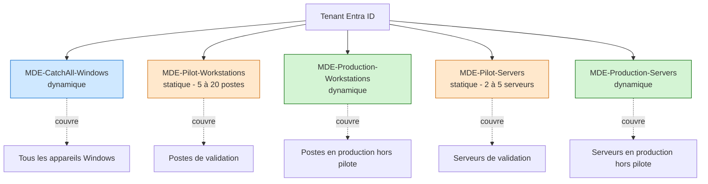
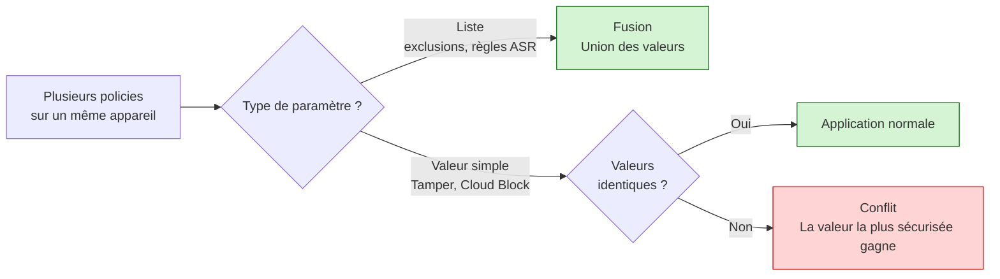
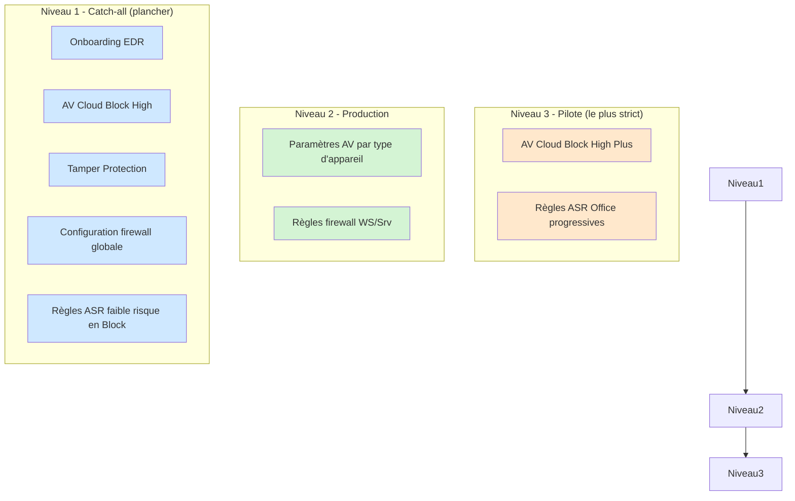
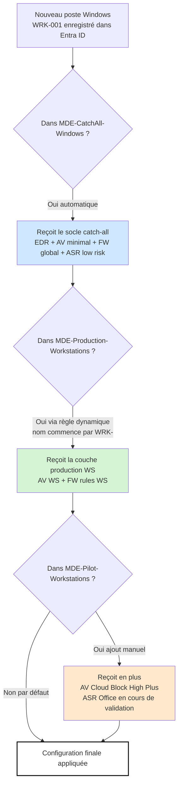

# Architecture

Ce document décrit les choix structurels du socle MDE Foundations : organisation des groupes, superposition des policies, et interaction entre les deux.

## Principes de conception

Le socle repose sur trois principes.

**Un filet de sécurité d'abord.** Un groupe catch-all avec des paramètres minimaux non négociables (antivirus actif, Tamper Protection, onboarding EDR) garantit que tout appareil Windows du tenant dispose d'un socle de protection, qu'il tombe ou non dans un groupe de ciblage spécifique.

**Des policies en couches plutôt qu'une policy monolithique.** Plutôt qu'une grosse policy par domaine, le socle utilise plusieurs petites policies qui se superposent. Le catch-all pose le minimum, les policies de production ajoutent les paramètres plus stricts, les policies pilote ajoutent les plus stricts. Cette logique de superposition s'appuie sur le comportement de fusion des policies Endpoint Security d'Intune.

**Séparation postes et serveurs.** Postes de travail et serveurs exposent des surfaces d'attaque différentes et ont des contraintes opérationnelles distinctes. Leurs policies sont séparées dès le départ, même lorsque les paramètres sont identiques, pour éviter d'avoir à scinder les affectations ultérieurement.

## Structure des groupes

Cinq groupes Entra ID, chacun avec un rôle clair.



### Pourquoi dynamique pour catch-all et production, statique pour les pilotes

Les groupes catch-all et production doivent être autonomes. Les nouveaux appareils joignant le tenant doivent recevoir automatiquement leurs policies sans intervention manuelle. C'est ce que permettent les groupes dynamiques.

Les groupes pilote sont volontairement gérés manuellement. Ajouter un appareil à un groupe pilote est un acte délibéré : il indique que cet appareil accepte de recevoir les paramètres les plus stricts en premier, en échange d'un avertissement préalable en cas de configuration cassante.

## Superposition des policies

Les policies Endpoint Security d'Intune fusionnent lorsque plusieurs policies ciblent un même appareil.



Ce comportement est ce qui rend l'approche en couches sécurisée. Le catch-all pose un plancher ; les policies de production ne peuvent que relever ce plancher, jamais l'abaisser.

## Hiérarchie des policies

Trois niveaux superposés, du plus large au plus restrictif.



## Flux d'application sur un appareil

Vue concrète de ce qu'un appareil reçoit selon son appartenance aux groupes.



## Matrice d'affectation

Affectation de chaque policy aux groupes correspondants.

| Policy | CatchAll | Pilot WS | Prod WS | Pilot Srv | Prod Srv |
|---|---|---|---|---|---|
| MDE-EDR-Onboarding | ✓ | | | | |
| MDE-AV-CatchAll | ✓ | | | | |
| MDE-AV-Workstations-Production | | | ✓ | | |
| MDE-AV-Servers-Production | | | | | ✓ |
| MDE-AV-Workstations-Pilot | | ✓ | | | |
| MDE-AV-Servers-Pilot | | | | ✓ | |
| MDE-FW-CatchAll | ✓ | | | | |
| MDE-FW-Rules-Workstations | | ✓ | ✓ | | |
| MDE-FW-Rules-Servers | | | | ✓ | ✓ |
| MDE-ASR-LowRisk-Block | ✓ | | | | |
| MDE-ASR-Office-Audit (phase initiale) | | ✓ | | | |
| MDE-ASR-Office-Warn (après pilote) | | | ✓ | | |
| MDE-ASR-Office-Block (après Warn) | | | ✓ | | |

## Pourquoi pas de policies ASR Office sur serveurs

Les règles ASR ciblant les applications Office (`Block all Office applications from creating child processes`, `Block Win32 API calls from Office macros`, etc.) n'ont pas de sens dans un contexte serveur classique. Les serveurs n'exécutent pas d'applications Office sous session interactive.

Des exceptions existent (SharePoint legacy avec automation Office côté serveur), mais elles sont rares et doivent être gérées avec des policies dédiées, en dehors du socle standard.

## Pourquoi une seule policy d'onboarding EDR pour postes et serveurs

La policy d'onboarding est identique pour les deux : même package, même configuration de partage d'échantillons, même fréquence de remontée télémétrique. La séparer ajouterait de la complexité sans bénéfice.

La différenciation postes / serveurs se fait dans les policies suivantes (antivirus, firewall, ASR), pas dans l'onboarding.

## Convention de nommage

Toutes les policies suivent ce schéma :

```
MDE-<Catégorie>-<Périmètre>[-<Sous-périmètre>]
```

Exemples :

- `MDE-EDR-Onboarding`
- `MDE-AV-CatchAll`
- `MDE-AV-Workstations-Production`
- `MDE-FW-Rules-Servers`
- `MDE-ASR-LowRisk-Block`
- `MDE-ASR-Office-Audit`

Cette nomenclature facilite l'identification, le filtrage et la lisibilité des policies. Renommer une policy après déploiement est à éviter, car cela peut casser les références documentaires.

## Étapes suivantes

- [03-reference-policies.md](03-reference-policies.md) - liste exhaustive de chaque paramètre dans chaque policy
- [04-plan-deploiement.md](04-plan-deploiement.md) - calendrier de déploiement semaine par semaine
