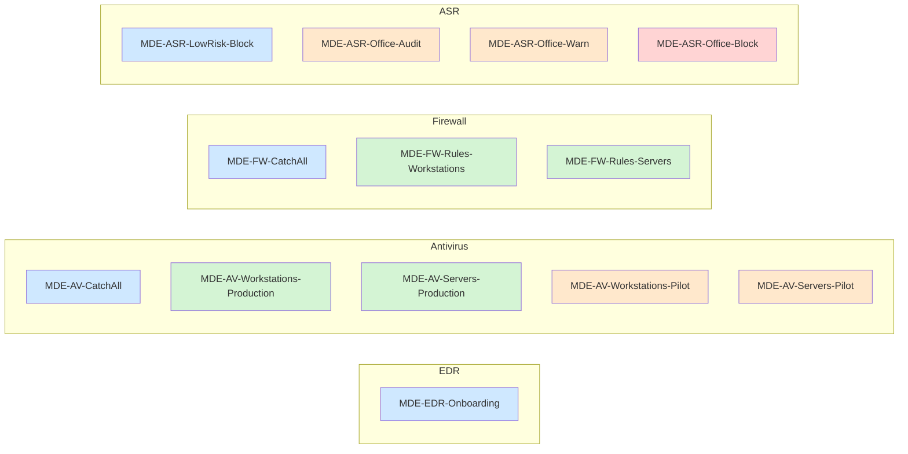
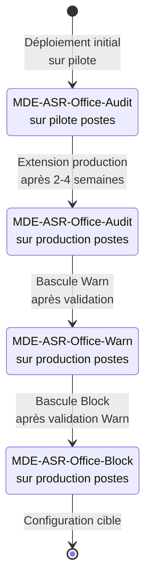

## Vue d'ensemble

Code couleur : bleu = socle catch-all, vert = production, orange = pilote / phase intermédiaire, rouge = phase finale Block.

| Catégorie | Policies | Nombre total |
|---|---|---|
| EDR | MDE-EDR-Onboarding | 1 |
| Antivirus | CatchAll, Workstations-Production, Servers-Production, Workstations-Pilot, Servers-Pilot | 5 |
| Firewall | CatchAll, Rules-Workstations, Rules-Servers | 3 |
| ASR | LowRisk-Block, Office-Audit, Office-Warn, Office-Block | 4 |

Total : 13 policies.

## Cycle de vie des règles ASR Office

Les règles ASR Office passent par trois phases de déploiement progressif. Vue d'ensemble du cycle :

Voir [04-plan-deploiement.md](04-plan-deploiement.md) pour le calendrier détaillé.
