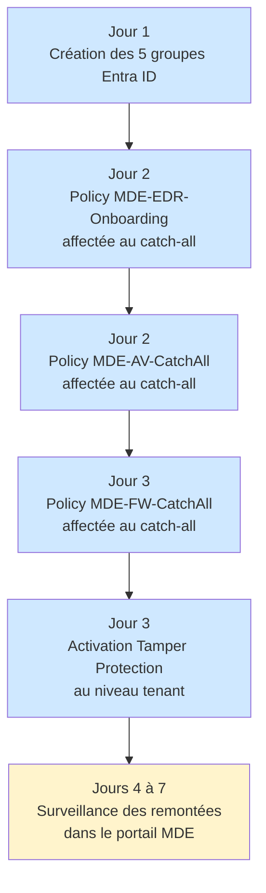
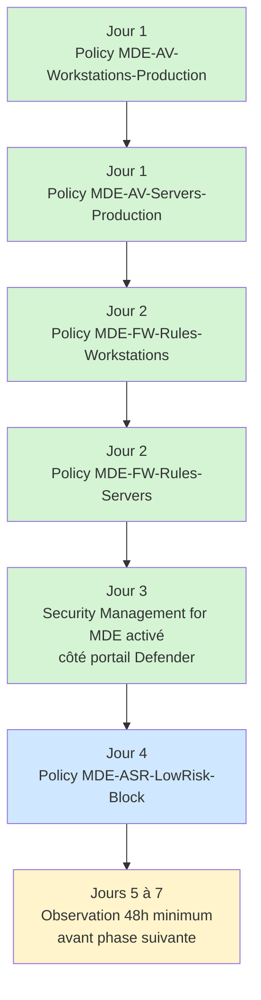
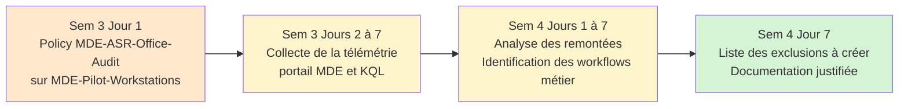
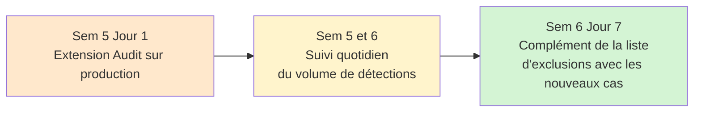
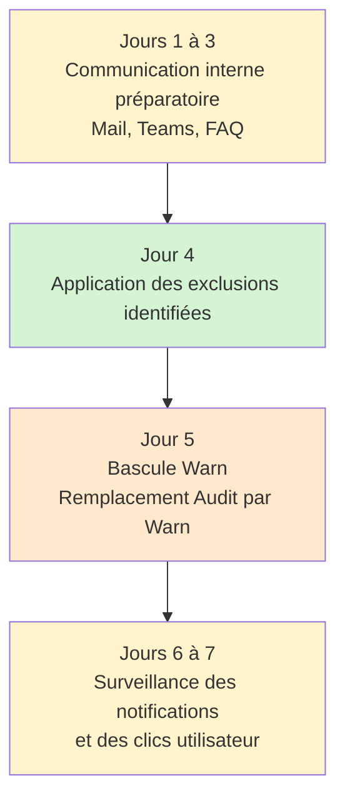
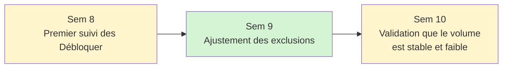
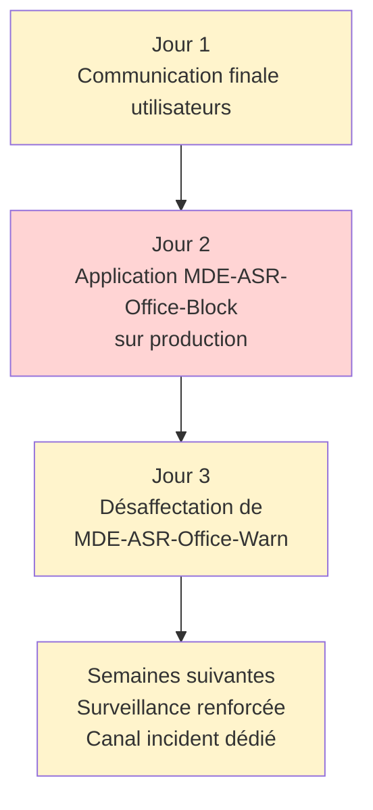

# Plan de déploiement

Ce document décrit la séquence de déploiement du socle MDE Foundations sur une période de onze semaines. Les durées sont indicatives et doivent être adaptées à la taille du parc et au volume de remontées observé.

## Principes du déploiement progressif

Le socle ne se déploie pas en une seule fois. Trois raisons à cela.

**Identification des incidents** : en déployant par vagues, l'origine d'un éventuel incident applicatif est plus facile à tracer. Si une dizaine de policies sont activées le même jour, isoler la responsable demande beaucoup plus de travail.

**Phase Audit pour les règles à impact** : certaines règles ASR nécessitent une observation prolongée avant blocage effectif. Activer en Block direct sans audit revient à découvrir les impacts métier en production.

**Validation avant extension** : chaque couche est d'abord testée sur le groupe pilote avant extension à la production. Un comportement inattendu sur cinq postes pilote est gérable, le même sur 500 postes production ne l'est pas.

## Vue d'ensemble du calendrier

```mermaid
gantt
    title Calendrier de déploiement MDE Foundations
    dateFormat X
    axisFormat Sem %s

    section Socle
    Création groupes Entra ID         :done, g1, 0, 3
    Policy EDR Onboarding             :done, e1, 3, 2
    Policy AV Catch-all               :done, a1, 5, 2
    Policy FW Catch-all               :done, f1, 7, 2
    Tamper Protection tenant          :done, t1, 9, 1

    section Production
    Policies AV/FW Workstations       :active, p1, 7, 5
    Policies AV/FW Servers            :active, p2, 7, 5
    Security Management for MDE       :active, sm, 7, 3
    ASR Low Risk Block                :active, ar, 9, 5

    section ASR Office Audit
    Audit sur pilote                  :asr1, 14, 14
    Audit sur production              :asr2, 28, 21

    section ASR Office Warn
    Préparation utilisateurs          :prep, 42, 7
    Warn sur production               :asr3, 49, 21

    section ASR Office Block
    Block sur production              :asr4, 70, 7
    Surveillance renforcée            :surv, 77, 14
```



Note : les unités sur l'axe sont en jours relatifs (Semaine 1 = jours 0 à 7, Semaine 2 = jours 7 à 14, etc.).

## Phase 1 - Mise en place du socle (Semaine 1)

Création des groupes Entra ID et activation des policies catch-all.

### Étapes



### Points de validation

À la fin de la Semaine 1, vérifier :

- Les cinq groupes Entra ID sont créés et leurs règles dynamiques fonctionnent correctement
- Les appareils Windows remontent dans le portail MDE avec le statut `Active`
- Tamper Protection apparaît comme `Enabled` sur un échantillon de postes (vérification PowerShell)
- Aucune remontée massive d'incident applicatif dans Intune (statuts `Erreur` ou `Conflit` sur les policies)

Voir [05-verification.md](05-verification.md) pour les commandes de vérification.

## Phase 2 - Déploiement production (Semaine 2)

Extension du socle vers les groupes production postes et serveurs, et activation de Security Management for MDE.

### Étapes



### Points de validation

À la fin de la Semaine 2, vérifier :

- Les policies de production sont appliquées sur les machines des groupes correspondants (statut `Réussi`)
- Les statuts `Conflit` éventuels sont tracés et compris (en général : aucune si les policies sont bien construites)
- Les machines hors Intune mais onboardées dans MDE reçoivent les policies via Security Management for MDE
- Aucune remontée d'incident applicatif lié à la règle ASR LSASS ou aux autres règles à faible risque

## Phase 3 - ASR Office Audit sur pilote (Semaines 3 et 4)

Première confrontation des règles ASR Office au monde réel, en mode passif (Audit).

### Étapes



### Analyse de la télémétrie

Pendant cette phase, suivre quotidiennement le dashboard `security.microsoft.com > Reports > Attack surface reduction rules`.

Pour chaque détection en Audit, déterminer :

- Le processus déclencheur est-il légitime ?
- Le chemin du processus est-il stable (pas dans un dossier temporaire) ?
- Le déclenchement est-il récurrent ou ponctuel ?
- Le processus appartient-il à une application métier identifiée ?

Les processus légitimes récurrents donnent lieu à une exclusion ASR par règle (et non globale) documentée dans le registre d'exclusions.

### Points de validation

À la fin de la Semaine 4, la liste des exclusions justifiées pour les règles Office doit être finalisée et documentée :

| Règle ASR | Processus exclu | Justification | Demandeur | Date de revue |
|---|---|---|---|---|

## Phase 4 - ASR Office Audit étendu (Semaines 5 et 6)

Extension de la phase Audit aux postes de production pour capter les workflows non présents sur le pilote.

### Étapes

Ajout de `MDE-Production-Workstations` à l'affectation de `MDE-ASR-Office-Audit`.



### Points de validation

À la fin de la Semaine 6, le volume de détections en Audit doit être stable (pas de nouveaux workflows identifiés depuis plusieurs jours). Si ce n'est pas le cas, prolonger la phase Audit d'une à deux semaines.

## Phase 5 - Préparation et bascule Warn (Semaine 7)

Communication utilisateur et bascule des règles ASR Office en mode Warn.

### Étapes



### Communication utilisateur

Le mode Warn provoque l'affichage d'une popup utilisateur lors d'une détection. Sans préparation, cela génère des appels au support. Préparer :

- Un mail de communication aux utilisateurs des postes pilote et production
- Un canal de remontée d'incident dédié (boîte mail, Teams)
- Une FAQ courte expliquant l'apparition de la popup

Le message clé : la popup est un signal de sécurité, l'utilisateur peut cliquer Débloquer pour 24 heures s'il a un besoin légitime, mais chaque déblocage est tracé.

### Points de validation

À la fin de la Semaine 7, vérifier que la policy Warn est bien appliquée et que les premières popups apparaissent sur les postes ayant des workflows déclencheurs.

## Phase 6 - Observation Warn (Semaines 8 à 10)

Phase critique d'observation. Les remontées Warn capturent les derniers cas non identifiés en Audit.

### Étapes



### Suivi du nombre de clics Débloquer

Requête KQL pour suivre les clics utilisateur en mode Warn :

```kql
DeviceEvents
| where Timestamp > ago(7d)
| where ActionType has "WarnBypassed"
| summarize Count = count() by DeviceName, ActionType, FileName
| order by Count desc
```

Si un volume élevé est constaté sur quelques processus spécifiques, créer des exclusions ciblées plutôt que de revenir en Audit.

### Critères de bascule vers Block

La bascule vers Block est validée lorsque les critères suivants sont remplis :

- Le volume hebdomadaire de clics Débloquer est faible (moins de quelques dizaines sur l'ensemble du parc)
- Les processus déclencheurs restants sont identifiés et traités (exclusion ou refus métier)
- Aucun nouveau workflow n'apparaît depuis au moins une semaine

Si l'un de ces critères n'est pas rempli, prolonger la phase Warn d'une semaine.

## Phase 7 - Bascule Block (Semaine 11 et au-delà)

Bascule définitive en mode bloquant.

### Étapes



### Important

Ne pas laisser coexister `MDE-ASR-Office-Warn` et `MDE-ASR-Office-Block` sur le même groupe. Cela génère des conflits sur les valeurs simples des règles ASR. La désaffectation de la policy Warn doit suivre immédiatement l'application de la policy Block.

### Surveillance post-bascule

Pendant les deux semaines suivant la bascule Block, suivre quotidiennement :

- Le volume de détections en Block dans le dashboard ASR
- Le nombre de remontées d'incident utilisateur via le canal dédié
- Les éventuels statuts `Conflit` apparaissant dans Intune

Tout pic anormal doit être analysé et donner lieu soit à une exclusion supplémentaire, soit à un retour temporaire en Warn pour l'application concernée.

## Tableau de bord de suivi

Pour suivre l'avancement du déploiement, un tableau simple à tenir au fil des semaines :

| Phase | Semaine | Statut | Date de bascule | Incidents notables |
|---|---|---|---|---|
| 1 - Socle | 1 | | | |
| 2 - Production | 2 | | | |
| 3 - ASR Office Audit pilote | 3 et 4 | | | |
| 4 - ASR Office Audit production | 5 et 6 | | | |
| 5 - Préparation et bascule Warn | 7 | | | |
| 6 - Observation Warn | 8 à 10 | | | |
| 7 - Bascule Block | 11 | | | |

## Étapes suivantes

Une fois le déploiement initial complet, voir :

- [05-verification.md](05-verification.md) - vérifications PowerShell et portail
- [06-personnalisation.md](06-personnalisation.md) - adaptation à un contexte spécifique
- [07-depannage.md](07-depannage.md) - résolution des problèmes courants
