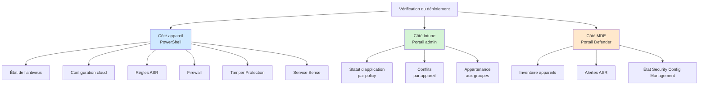
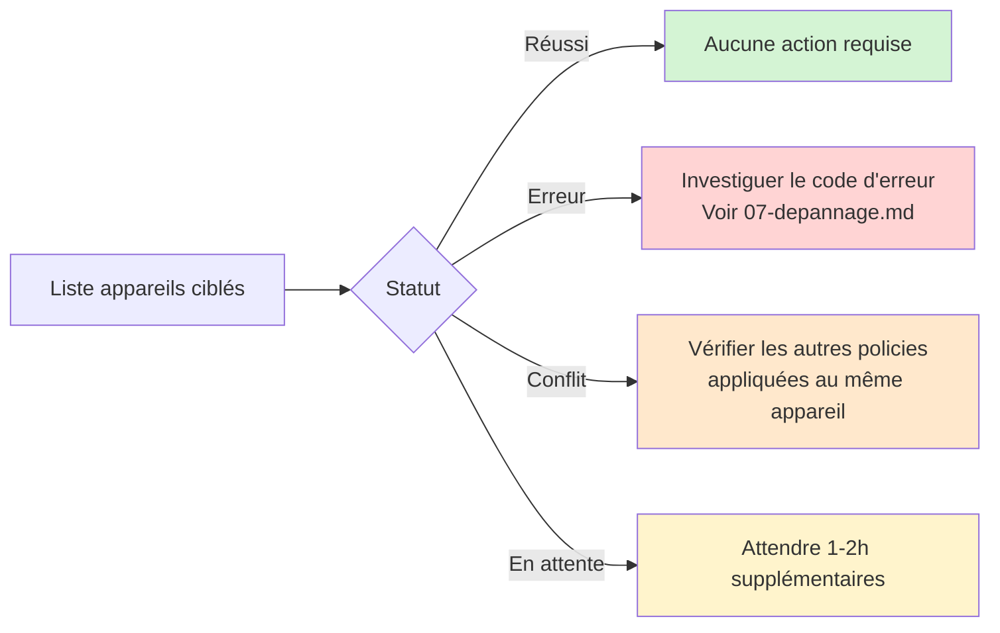
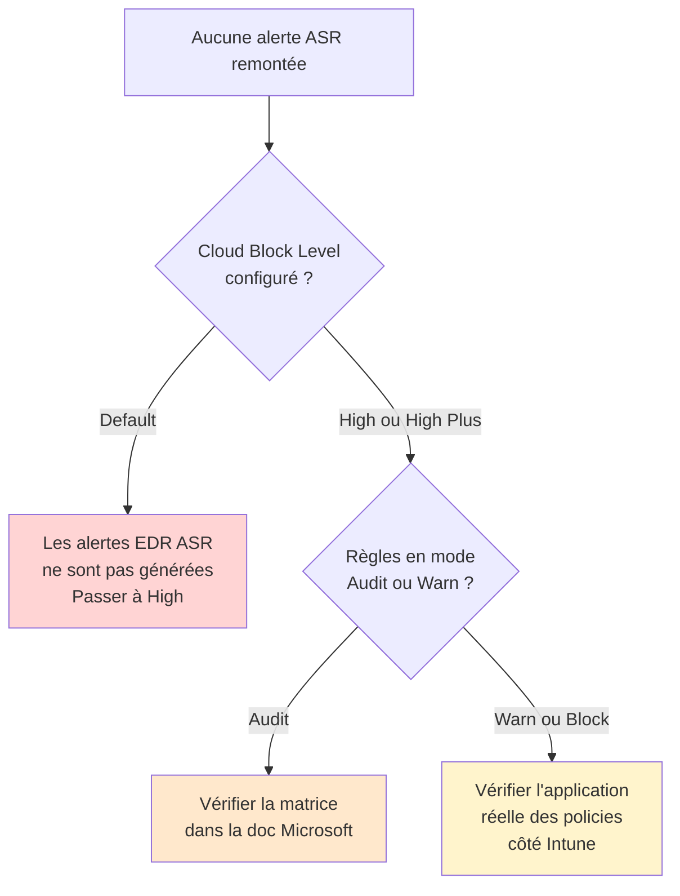

# Vérification du déploiement

Ce document liste les commandes et vues à utiliser pour vérifier qu'un déploiement MDE Foundations s'est correctement appliqué sur les appareils cibles.

## Vue d'ensemble des points de vérification



## Vérifications côté appareil

Toutes les commandes ci-dessous doivent être exécutées depuis une session PowerShell en tant qu'administrateur local sur l'appareil cible.

### État global de l'antivirus

```powershell
Get-MpComputerStatus | Select-Object -Property `
    AMRunningMode, `
    AntivirusEnabled, `
    RealTimeProtectionEnabled, `
    IsTamperProtected, `
    OnboardingState, `
    AMServiceEnabled, `
    BehaviorMonitorEnabled, `
    IoavProtectionEnabled, `
    OnAccessProtectionEnabled
```

Valeurs attendues :

| Propriété | Valeur attendue |
|---|---|
| AMRunningMode | Normal |
| AntivirusEnabled | True |
| RealTimeProtectionEnabled | True |
| IsTamperProtected | True |
| OnboardingState | 1 |
| AMServiceEnabled | True |
| BehaviorMonitorEnabled | True |
| IoavProtectionEnabled | True |
| OnAccessProtectionEnabled | True |

Toute valeur différente indique un problème de configuration à investiguer.

### Configuration de la protection cloud

```powershell
Get-MpPreference | Select-Object -Property `
    MAPSReporting, `
    CloudBlockLevel, `
    CloudExtendedTimeout, `
    SubmitSamplesConsent, `
    DisableBlockAtFirstSeen
```

Valeurs attendues :

| Propriété | Valeur attendue | Signification |
|---|---|---|
| MAPSReporting | 2 (Advanced) | Protection cloud activée |
| CloudBlockLevel | 4 (High) ou 6 (High Plus) | Niveau de blocage cloud |
| CloudExtendedTimeout | 50 | Délai d'attente de la réponse cloud |
| SubmitSamplesConsent | 1 | Envoi automatique des échantillons sûrs |
| DisableBlockAtFirstSeen | False | Block at First Sight activé |

### Règles ASR

```powershell
Get-MpPreference | Select-Object -Property `
    AttackSurfaceReductionRules_Ids, `
    AttackSurfaceReductionRules_Actions, `
    AttackSurfaceReductionOnlyExclusions
```

La sortie liste les GUID des règles configurées et leur état correspondant :

| Action | État de la règle |
|---|---|
| 0 | Not Configured / Disabled |
| 1 | Block |
| 2 | Audit |
| 6 | Warn |

Pour une lecture plus lisible, croiser avec le tableau des GUID dans [03-reference-policies.md](03-reference-policies.md).

### État du firewall

```powershell
Get-NetFirewallProfile -PolicyStore ActiveStore | Select-Object -Property `
    Name, `
    Enabled, `
    DefaultInboundAction, `
    DefaultOutboundAction, `
    AllowLocalPolicyMerge, `
    AllowLocalIPsecPolicyMerge
```

Valeurs attendues pour chacun des trois profils (Domain, Private, Public) :

| Propriété | Valeur attendue |
|---|---|
| Enabled | True |
| DefaultInboundAction | Block |
| DefaultOutboundAction | Allow |
| AllowLocalPolicyMerge | False |
| AllowLocalIPsecPolicyMerge | False |

Lister les règles firewall actives héritées d'Intune :

```powershell
Get-NetFirewallRule -PolicyStore ActiveStore | Where-Object { 
    $_.PolicyStoreSource -like "*Intune*" 
} | Select-Object DisplayName, Direction, Action, Enabled
```

### Test de Tamper Protection

Tenter une modification qui devrait être bloquée par Tamper Protection :

```powershell
Set-MpPreference -DisableRealtimeMonitoring $true
```

La commande retourne sans erreur visible, mais la valeur ne doit pas être appliquée. Vérification :

```powershell
Get-MpPreference | Select-Object DisableRealtimeMonitoring
```

Valeur attendue : `False`. Si la valeur est passée à `True`, Tamper Protection n'est pas effective.

Dans le journal Windows, l'événement de tentative bloquée :

```powershell
Get-WinEvent -LogName "Microsoft-Windows-Windows Defender/Operational" | `
    Where-Object { $_.Id -eq 5004 } | `
    Select-Object -First 5 TimeCreated, Message
```

L'Event ID `5004` correspond à une tentative de modification bloquée par Tamper Protection.

### Service Sense (sur serveurs Windows Server 2012 R2 et 2016)

```powershell
Get-Service -Name Sense | Select-Object Status, StartType
```

Valeurs attendues :

| Propriété | Valeur attendue |
|---|---|
| Status | Running |
| StartType | Automatic |

Si `Status` est `Stopped`, vérifier les logs dans :

```
C:\ProgramData\Microsoft\Windows Defender Advanced Threat Protection\Logs\
```

## Vérifications côté Intune

### Statut d'application par policy

`intune.microsoft.com > Endpoint security > [type de policy] > [nom de policy] > Device status`

Pour chaque policy, la liste des appareils et leur statut :



### Conflits par appareil

`intune.microsoft.com > Devices > [appareil cible] > Device configuration`

Si un statut `Conflit` apparaît :

1. Identifier le paramètre exact en conflit (la vue détaillée le mentionne)
2. Lister toutes les policies appliquées à l'appareil
3. Identifier laquelle pousse une valeur différente
4. Décider : ajuster une des policies, ou retirer celle qui ne devrait plus s'appliquer

### Vérification de l'appartenance aux groupes

`intune.microsoft.com > Groups > [nom du groupe] > Members`

Pour les groupes dynamiques :

- Vérifier que le nombre de membres correspond aux attentes
- Cliquer sur "Validate rules" pour tester la règle dynamique sur un appareil spécifique

### État de Security Management for MDE

`intune.microsoft.com > Tenant administration > Connectors and tokens > Microsoft Defender for Endpoint`

Vérifier que la connexion est `Active` et que la fonctionnalité de gestion de sécurité depuis le portail Defender est cochée.

## Vérifications côté portail Defender

### Inventaire des appareils

`security.microsoft.com > Assets > Devices`

Filtrer par statut :

- `Active` : appareil onboardé et remontant de la télémétrie
- `Inactive` : appareil onboardé mais sans télémétrie récente (plus de 7 jours)
- `Misconfigured` : configuration incomplète, voir détails dans la fiche appareil

Pour les appareils gérés via Security Management for MDE, ils apparaissent avec la mention `Managed by MDE` dans la colonne `Managed by`.

### Alertes ASR

`security.microsoft.com > Reports > Attack surface reduction rules`

Vue par règle et par appareil sur la période sélectionnée. Filtres disponibles :

- État de la règle (Audit, Warn, Block)
- Nom de la règle
- Appareil ou utilisateur
- Plage de dates

Si aucune alerte ASR n'apparaît alors que des règles sont configurées :



### État de l'onboarding via la console

`security.microsoft.com > Settings > Endpoints > Device management > Onboarding status`

Vue d'ensemble des appareils onboardés et de leur méthode (Intune, GPO, script local, MDE Security Config Management).

## Vérifications via Advanced Hunting

Quelques requêtes KQL utiles pour vérifier le déploiement à l'échelle.

### Appareils sans Tamper Protection active

```kql
DeviceInfo
| where Timestamp > ago(7d)
| summarize arg_max(Timestamp, *) by DeviceName
| where OnboardingStatus == "Onboarded"
| where IsTamperProtected == false
| project DeviceName, OSPlatform, OSVersion, LastSeen = Timestamp
```

Tout appareil retourné par cette requête doit être investigué.

### Appareils avec Cloud Block Level non conforme

```kql
DeviceInfo
| where Timestamp > ago(7d)
| summarize arg_max(Timestamp, *) by DeviceName
| where OnboardingStatus == "Onboarded"
| extend CloudBlockLevel = tostring(MdatpDeviceInfo.CloudBlockLevel)
| where CloudBlockLevel != "High" and CloudBlockLevel != "HighPlus"
| project DeviceName, OSPlatform, CloudBlockLevel
```

### Détections ASR par règle sur les 30 derniers jours

```kql
DeviceEvents
| where Timestamp > ago(30d)
| where ActionType startswith "Asr"
| summarize Count = count() by ActionType
| order by Count desc
```

### Appareils en mode Audit sur les règles Office depuis plus de 60 jours

```kql
DeviceEvents
| where Timestamp > ago(60d)
| where ActionType startswith "AsrOffice" and ActionType endswith "Audited"
| summarize FirstSeen = min(Timestamp), LastSeen = max(Timestamp) by DeviceName
| where FirstSeen < ago(60d)
```

Cette requête identifie les appareils restés en mode Audit sur les règles Office depuis trop longtemps. Le mode Audit n'est pas une configuration cible.

## Checklist de validation finale

Après déploiement complet, valider l'ensemble des points suivants.

### Côté infrastructure

- [ ] Les cinq groupes Entra ID sont créés et leurs règles dynamiques sont fonctionnelles
- [ ] Toutes les policies du socle sont déployées (13 policies au total)
- [ ] Les affectations correspondent à la matrice d'affectation
- [ ] Tamper Protection est activée au niveau tenant
- [ ] Security Management for MDE est activé si nécessaire
- [ ] Automated Investigation est en mode Semi

### Côté appareils (échantillonnage)

Sur au moins trois postes et deux serveurs :

- [ ] Antivirus en mode Normal avec protection temps réel active
- [ ] Tamper Protection active et test de modification bloqué
- [ ] Cloud Block Level à High (ou High Plus pour les pilotes)
- [ ] Firewall actif sur les trois profils avec les valeurs attendues
- [ ] Règles ASR du catch-all configurées
- [ ] Service Sense en cours d'exécution
- [ ] OnboardingState à 1

### Côté portail

- [ ] Aucun statut `Erreur` durable sur les policies (au-delà de 48h)
- [ ] Les statuts `Conflit` sont tracés et expliqués
- [ ] Les appareils remontent correctement dans l'inventaire MDE
- [ ] Les premières alertes ASR apparaissent dans le dashboard (catch-all en Block)

## Étapes suivantes

- [06-personnalisation.md](06-personnalisation.md) - adapter le socle à son contexte spécifique
- [07-depannage.md](07-depannage.md) - résolution des problèmes courants
