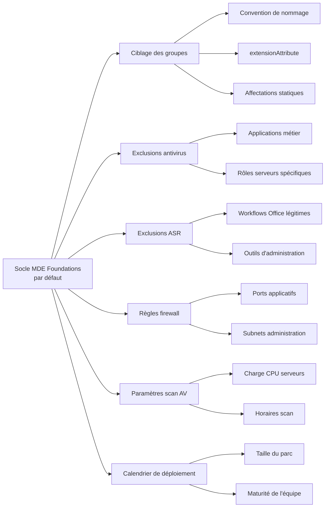
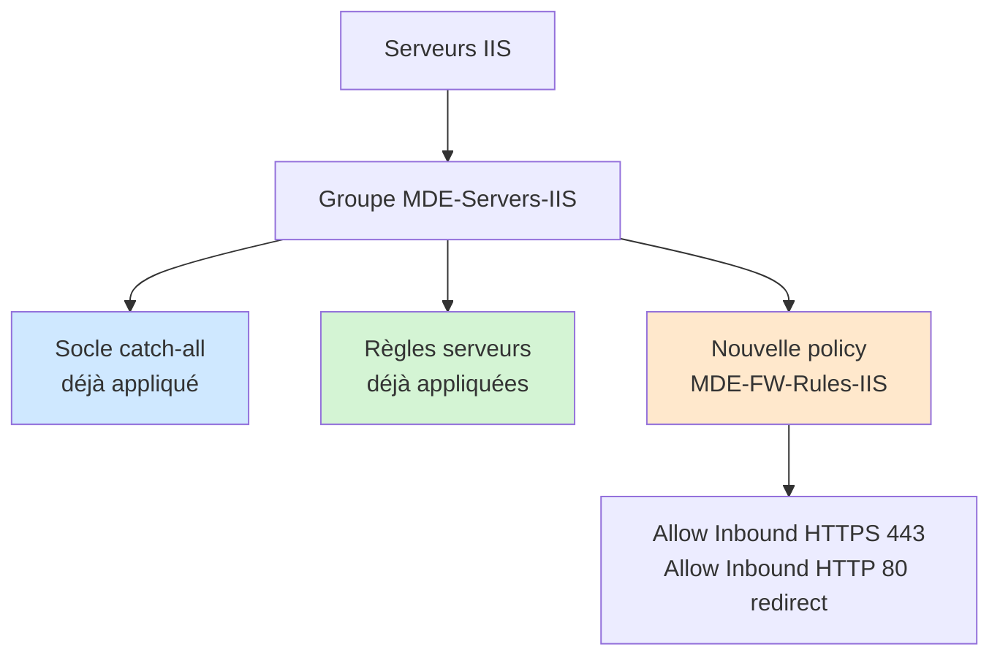

# Personnalisation

Le socle MDE Foundations est un point de départ. Ce document liste les axes d'adaptation à un contexte spécifique : convention de nommage différente, périmètre serveur particulier, applications métier, exigences réglementaires.

## Axes de personnalisation possibles



## Adaptation du ciblage des groupes

Les règles dynamiques par défaut reposent sur un préfixe de nom (`WRK-`, `SRV-`). Plusieurs alternatives existent.

### Convention de nommage différente

Si la convention de nommage en place utilise d'autres préfixes, adapter les règles dynamiques en conséquence :

```
(device.deviceOSType -eq "Windows") 
and (device.displayName -startsWith "LAP-")
```

ou avec plusieurs préfixes acceptés :

```
(device.deviceOSType -eq "Windows") 
and (
    (device.displayName -startsWith "WRK-") 
    or (device.displayName -startsWith "LAP-") 
    or (device.displayName -startsWith "DT-")
)
```

### Utilisation d'extensionAttribute

En l'absence de convention de nommage exploitable, utiliser un `extensionAttribute` synchronisé depuis Active Directory.

Étape 1 : sur les objets ordinateur dans Active Directory, renseigner un attribut (par exemple `extensionAttribute1`) avec une valeur identifiant le type de machine :

```powershell
# Pour un poste de travail
Set-ADComputer -Identity "WRK-001" -Replace @{extensionAttribute1="Workstation"}

# Pour un serveur
Set-ADComputer -Identity "SRV-001" -Replace @{extensionAttribute1="Server"}
```

Étape 2 : Entra Connect synchronise cet attribut vers Entra ID au prochain cycle de synchronisation.

Étape 3 : adapter la règle dynamique du groupe production :

```
(device.deviceOSType -eq "Windows") 
and (device.extensionAttribute1 -eq "Workstation")
```

### Affectations statiques transitoires

Si ni la convention de nommage ni l'extensionAttribute ne sont disponibles immédiatement, basculer les groupes production en statique le temps de la transition. À éviter sur le long terme car la maintenance manuelle des affectations finit toujours par dériver.

## Exclusions antivirus métier

Le socle ne définit aucune exclusion antivirus. Les exclusions doivent vivre dans des policies dédiées, pas dans les policies génériques.

### Création d'une policy d'exclusions dédiée

Pour chaque application métier nécessitant des exclusions, créer une policy Antivirus dédiée :

| Champ | Valeur |
|---|---|
| Nom | MDE-AV-Exclusions-{NomApplication} |
| Profil | Microsoft Defender Antivirus |
| Paramètres | Uniquement les exclusions, rien d'autre |
| Affectation | Groupe ciblant uniquement les machines concernées |

### Discipline d'exclusion

Chaque exclusion doit avoir :

- Une justification documentée (ticket, demande applicative, recommandation éditeur)
- Une revue programmée tous les six mois
- Le périmètre le plus étroit possible (chemin précis plutôt qu'un dossier parent)
- Un type Processus plutôt que Chemin quand c'est possible

Le registre d'exclusions à tenir :

| Application | Type | Valeur | Justification | Demandeur | Date de création | Date de revue |
|---|---|---|---|---|---|---|

### Exclusions à éviter absolument

Indépendamment du contexte métier, certaines exclusions sont presque toujours problématiques :

- `C:\Program Files\*`
- `C:\Windows\Temp\*`
- `C:\Users\*\AppData\Local\Temp\*`
- Extensions génériques (`.exe`, `.dll`, `.ps1`)
- Partages réseau entiers

Si ce type d'exclusion est demandé, remonter à l'éditeur de l'application : c'est rarement une vraie nécessité.

## Exclusions ASR

Les exclusions ASR fonctionnent différemment des exclusions antivirus. Toujours utiliser des exclusions par règle (paramètre `ASR Only Per Rule Exclusions`), jamais globales.

### Structure d'une exclusion ASR par règle

Format : `{GUID de la règle}|{chemin du processus}`

Exemple pour exclure un processus métier de la règle `Block all Office applications from creating child processes` :

```
d4f940ab-401b-4efc-aadc-ad5f3c50688a|C:\Program Files\AppMetier\AppMetier.exe
```

### Policy d'exclusions ASR

Créer une policy dédiée :

| Champ | Valeur |
|---|---|
| Nom | MDE-ASR-Exclusions |
| Profil | Règles de réduction de la surface d'attaque |
| Paramètre | ASR Only Per Rule Exclusions |
| Affectation | Tous les groupes nécessitant l'exclusion |

## Règles firewall additionnelles

Le socle pose les règles de base. Pour des règles applicatives spécifiques (IIS, SQL Server, Exchange, applications métier sur ports custom), créer des policies firewall dédiées par rôle ou par application.

### Exemple : règles pour un serveur IIS



Le groupe `MDE-Servers-IIS` est statique ou dynamique selon ton organisation. La policy `MDE-FW-Rules-IIS` ne contient que les règles spécifiques au rôle IIS, en supplément du socle existant.

## Paramètres antivirus pour environnements à forte charge IO

Sur des serveurs avec une charge IO intense (bases de données, serveurs de fichiers, hyperviseurs), les paramètres par défaut peuvent impacter les performances.

### Paramètres ajustables

| Paramètre | Valeur par défaut socle | Valeur ajustée environnement IO intense |
|---|---|---|
| Avg CPU Load Factor | 10 (serveurs) | 5 à 10 |
| Schedule Quick Scan Time | 03:00 | Plage de faible activité |
| Disable CPU Throttle On Idle Scans | Disabled | Disabled (ne pas désactiver le throttling) |
| Real Time Scan Direction | Bi-directional | Incoming only sur serveurs de fichiers |

### Important

Ne jamais désactiver la protection temps réel pour gagner en performance. C'est une option à éviter dans tous les cas. Si la charge est vraiment problématique, utiliser les exclusions ciblées par chemin de base de données ou processus applicatif, après validation avec l'éditeur de l'application.

## Calendrier de déploiement

Le calendrier sur onze semaines est calibré pour un parc de plusieurs centaines de postes hétérogènes. Quelques pistes d'adaptation.

### Parc très réduit ou homogène

Sur un parc inférieur à 50 postes avec des usages homogènes, certaines phases d'observation peuvent être raccourcies. La règle reste : ne pas sauter une phase, mais la durée d'observation peut être divisée.

### Parc très grand ou très hétérogène

Sur un parc supérieur à 1000 postes avec beaucoup de variations métier, les phases d'observation doivent être prolongées. Les exclusions à identifier sont plus nombreuses, et le volume de remontées Audit demande plus de temps d'analyse.

### Maturité de l'équipe sécurité

Si l'équipe découvre MDE et son exploitation, prévoir une période de montée en compétence avant la phase ASR Office. Le mode Audit génère du volume à analyser : sans expérience préalable, la phase peut s'enliser.

## Cas particuliers

### Postes de développeurs

Les postes de développeurs ont des usages atypiques (compilation, exécution de binaires non signés, scripts). Ils déclenchent davantage de règles ASR.

Approche recommandée :

- Créer un groupe `MDE-Developers-Workstations` dédié
- Y déployer les policies AV et FW standards
- Pour ASR Office, utiliser le mode Warn plutôt que Block sur ce groupe (en assumant que les développeurs sont avertis et capables de débloquer un faux positif en connaissance de cause)
- Maintenir une liste d'exclusions spécifique aux outils de développement utilisés

### Serveurs de virtualisation (Hyper-V)

Les hyperviseurs Hyper-V appliquent automatiquement les exclusions liées au rôle. Vérifier que `Disable Auto Exclusions` reste à `Not Configured` ou `Disabled` sur ces serveurs.

Si une gestion explicite des exclusions est préférée pour des raisons d'audit, désactiver les Auto Exclusions et reproduire manuellement la liste documentée par Microsoft pour Hyper-V.

### Contrôleurs de domaine

Les contrôleurs de domaine sont des serveurs particulièrement sensibles. Quelques recommandations :

- Affecter les contrôleurs de domaine au groupe `MDE-Pilot-Servers` même en production, pour bénéficier du Cloud Block Level High Plus et identifier rapidement tout comportement suspect
- Vérifier que les exclusions automatiques liées au rôle AD DS sont bien appliquées
- Activer Live Response sur ces serveurs (MDE P2 requis)
- Définir une procédure d'investigation prioritaire en cas d'alerte EDR

### Environnements régulés (santé, finance, défense)

Pour les environnements soumis à des exigences réglementaires fortes, plusieurs ajustements :

- Désactiver `Disable Auto Exclusions` pour gérer toutes les exclusions de manière explicite et auditable
- Configurer `Submit Samples Consent` sur `Never send` ou `Always prompt` selon la classification des données
- Tracer toutes les modifications de policies dans un registre indépendant
- Programmer des revues de configuration trimestrielles plutôt que semestrielles

## Étapes suivantes

- [07-depannage.md](07-depannage.md) - résolution des problèmes courants
