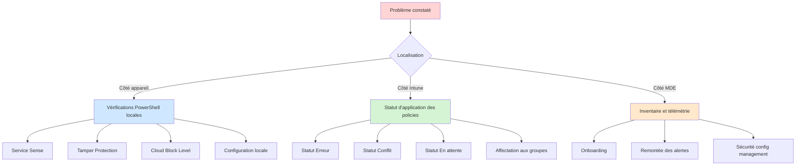
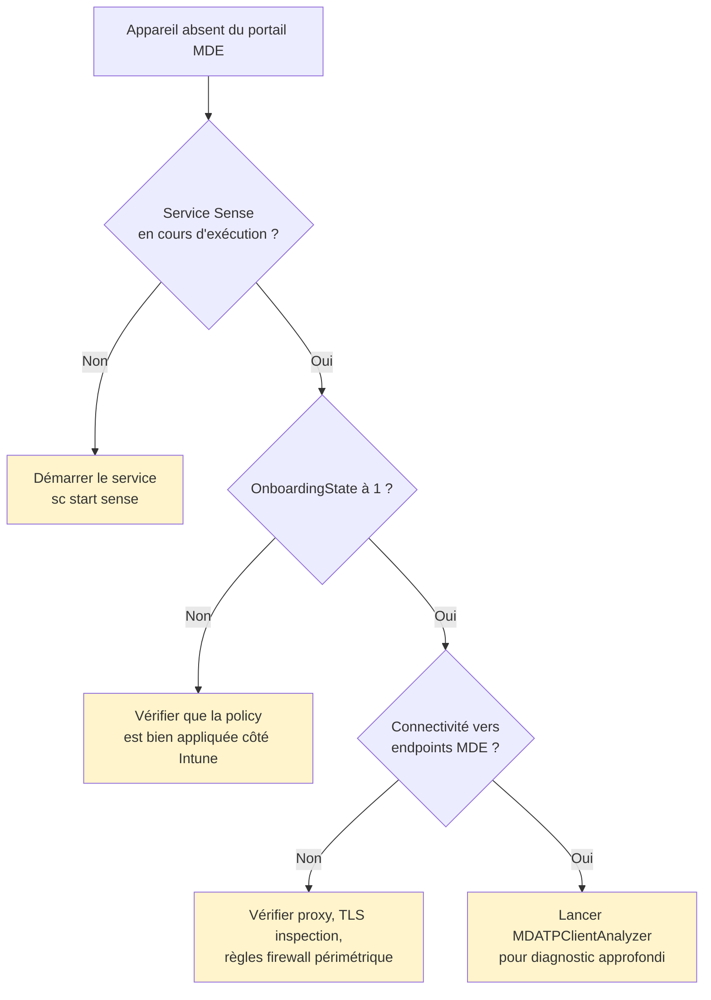
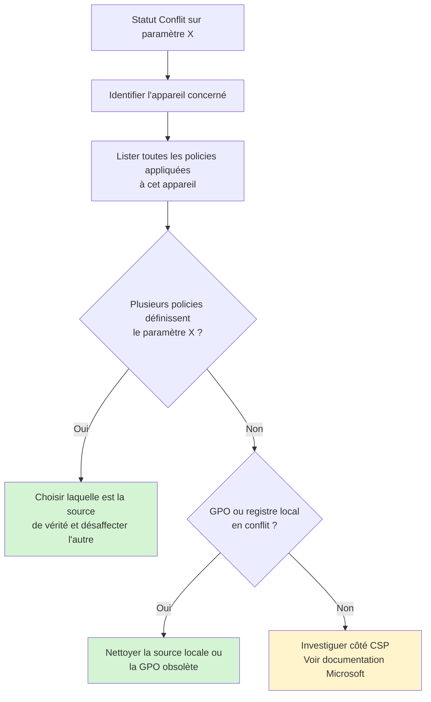
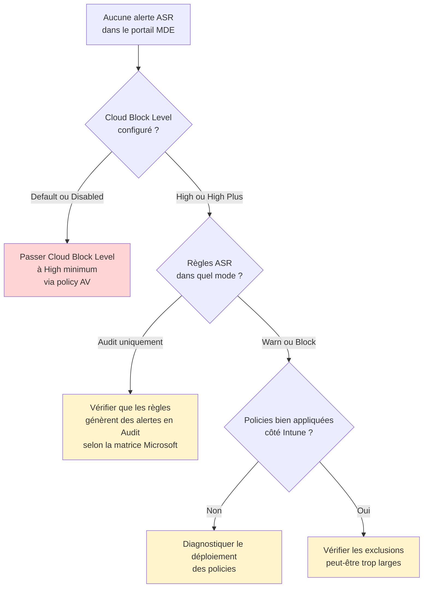
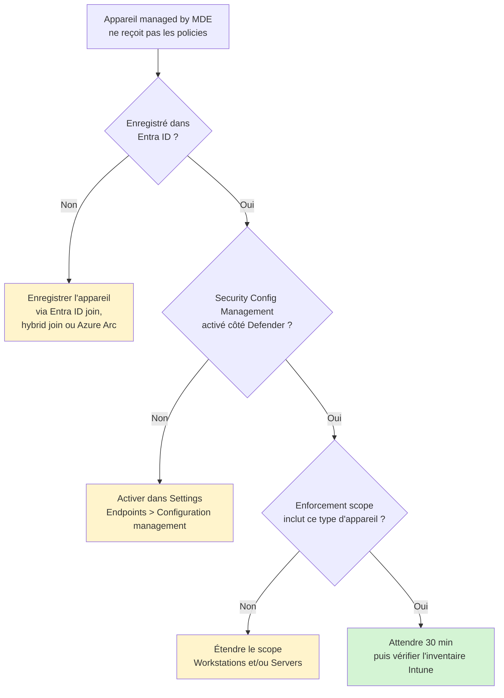
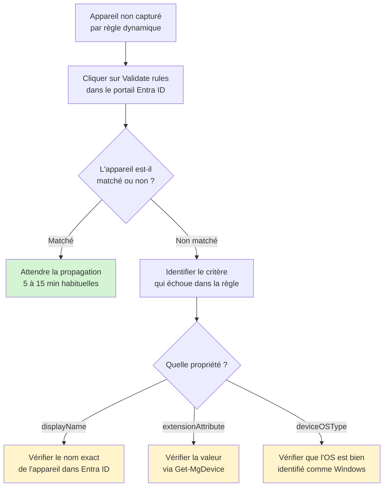

# Dépannage

Ce document liste les problèmes courants rencontrés lors du déploiement et de l'exploitation du socle MDE Foundations, avec les démarches de résolution associées.

## Arbre de décision général



## Problèmes d'onboarding

### Symptôme : l'appareil n'apparaît pas dans MDE après plus d'une heure



### Commandes de diagnostic

Statut du service Sense :

```powershell
Get-Service -Name Sense
sc query sense
```

État d'onboarding :

```powershell
Get-MpComputerStatus | Select-Object OnboardingState, AMRunningMode
```

Logs détaillés :

```
C:\ProgramData\Microsoft\Windows Defender Advanced Threat Protection\Logs\
```

Outil officiel de diagnostic : `MDATPClientAnalyzer`, téléchargeable depuis `security.microsoft.com > Settings > Endpoints > Troubleshooting`.

## Problèmes d'application des policies

### Symptôme : statut Erreur sur une policy dans Intune

Cliquer sur le statut Erreur ouvre le détail de l'erreur avec un code. Les codes les plus fréquents :

| Code | Signification | Résolution |
|---|---|---|
| `0x87D1FDE8` | Conflit de remédiation | Identifier la policy concurrente et désaffecter |
| `0x87D101F7` | Setting non supporté sur l'OS | Vérifier la compatibilité OS du paramètre |
| `0x87D101F4` | Échec de communication MDM | Forcer une synchronisation depuis l'appareil |
| `0x87D1B57C` | Source de stratégie en conflit | Vérifier l'absence de GPO ou de registre conflictuel |

Forcer une synchronisation depuis l'appareil :

```powershell
# Synchronisation MDM manuelle
Start-Process "C:\Windows\System32\DeviceEnroller.exe" -ArgumentList "/c","/AutoEnrollMDM"

# Ou via la commande dédiée Intune
Get-ScheduledTask -TaskName "*PushLaunch*" | Start-ScheduledTask
```

### Symptôme : statut Conflit récurrent sur un paramètre



### Symptôme : statut En attente prolongé

Si une policy reste en statut `En attente` au-delà de 24h :

- Vérifier que l'appareil communique correctement avec Intune (`dsregcmd /status`)
- Forcer une synchronisation MDM
- Redémarrer l'appareil si nécessaire
- Vérifier que l'appareil est bien dans le groupe ciblé par la policy (membership dynamique éventuellement non encore évaluée)

## Problèmes spécifiques au catch-all et à la superposition

### Symptôme : un appareil ne reçoit pas le catch-all

Causes possibles :

- L'appareil n'est pas enregistré dans Entra ID (poste workgroup, serveur domain-only sans hybrid join)
- La règle dynamique du groupe `MDE-CatchAll-Windows` n'a pas encore évalué l'appareil (délai habituel : 5 à 15 minutes)
- L'appareil est sur un OS non Windows (filtre `deviceOSType -eq "Windows"`)

Vérification : `intune.microsoft.com > Groups > MDE-CatchAll-Windows > Members`

### Symptôme : un appareil reçoit le catch-all mais pas la couche production

Causes possibles :

- Le nom de l'appareil ne correspond pas au préfixe attendu (`WRK-`, `SRV-`)
- L'`extensionAttribute` utilisé dans la règle dynamique n'est pas renseigné ou pas synchronisé
- L'appareil est dans le groupe pilote, ce qui peut être souhaité ou non selon l'intention

Vérification de l'appartenance aux groupes :

```powershell
# Via Microsoft Graph PowerShell
Connect-MgGraph -Scopes "GroupMember.Read.All", "Directory.Read.All"
$device = Get-MgDevice -Filter "displayName eq 'WRK-001'"
Get-MgDeviceMemberOf -DeviceId $device.Id
```

## Problèmes ASR

### Symptôme : aucune alerte ASR ne remonte dans le portail



### Symptôme : faux positif persistant sur une règle ASR

Démarche en quatre étapes :

1. Identifier le processus déclencheur via le portail MDE ou KQL
2. Vérifier la légitimité du processus (chemin, signature, contexte applicatif)
3. Créer une exclusion par règle (et non globale) avec justification documentée
4. Surveiller pendant une semaine après ajout de l'exclusion

KQL d'identification :

```kql
DeviceEvents
| where Timestamp > ago(7d)
| where DeviceName == "WRK-001"
| where ActionType startswith "Asr"
| project Timestamp, ActionType, FileName, FolderPath, InitiatingProcessFileName, InitiatingProcessCommandLine
| order by Timestamp desc
```

### Symptôme : règle LSASS classée "Not Applicable"

Cas attendu si la LSA Protection est activée au niveau Windows. La protection est équivalente, mais portée par Windows plutôt que par MDE.

Vérification :

```powershell
# Vérifier l'état de la LSA Protection
Get-ItemProperty -Path "HKLM:\SYSTEM\CurrentControlSet\Control\Lsa" -Name "RunAsPPL" -ErrorAction SilentlyContinue
```

Valeur 1 ou 2 = LSA Protection active.

## Problèmes de Tamper Protection

### Symptôme : Tamper Protection ne s'active pas malgré la policy

Vérifications par ordre de probabilité :

1. La policy Antivirus contenant `Tamper Protection = Enabled` est bien appliquée (statut `Réussi`)
2. L'activation au niveau tenant est ON dans le portail Defender
3. Aucun antivirus tiers ne bloque l'activation
4. L'appareil est bien onboardé dans MDE (sans onboarding, Tamper Protection ne s'applique pas)

### Symptôme : test de modification non bloqué

Si après application de la policy, `Set-MpPreference -DisableRealtimeMonitoring $true` modifie effectivement la valeur :

- Vérifier `Get-MpComputerStatus | Select-Object IsTamperProtected` (doit être `True`)
- Vérifier dans le portail Defender l'état Tamper Protection sur l'appareil
- Forcer une synchronisation MDM
- Si le problème persiste, ouvrir un ticket Microsoft Support

## Problèmes de Security Management for MDE

### Symptôme : un appareil onboardé dans MDE ne reçoit pas les policies Intune malgré l'absence de licence Intune



### Vérification de l'état Security Config Management

`security.microsoft.com > Settings > Endpoints > Configuration management > Onboarded devices`

L'appareil doit apparaître avec un statut `MDE` dans la colonne `Management channel`. Si le statut est `MEM`, l'appareil est enrollé dans Intune classique et ne passe pas par Security Config Management.

## Problèmes de groupes dynamiques Entra ID

### Symptôme : la règle dynamique ne capture pas certains appareils



### Délai de propagation des règles dynamiques

Délais habituels :

- Premier calcul après création de la règle : jusqu'à 60 minutes
- Évaluation suite à modification d'un appareil : 5 à 15 minutes
- Cas exceptionnels (tenants très chargés) : jusqu'à plusieurs heures

Si le délai dépasse 24h, ouvrir un ticket Microsoft Support.

## Récupération après incident

### Désactivation rapide d'une policy

En cas d'incident applicatif majeur lié à une policy MDE Foundations :

1. Identifier la policy responsable via le statut des appareils impactés
2. Dans Intune, désaffecter le ou les groupes concernés (action immédiate)
3. Attendre 30 minutes pour la propagation
4. Diagnostiquer la cause sans pression
5. Réintroduire la policy avec la correction nécessaire

### Restauration d'une policy supprimée par erreur

Intune ne maintient pas d'historique de versions des policies. En cas de suppression accidentelle :

1. La policy doit être recréée à partir de la documentation
2. Les exports IntuneManagement ou les exports JSON Graph servent de référence
3. Le journal d'audit Intune (`Tenant administration > Audit logs`) permet d'identifier qui a fait quoi et quand

D'où l'intérêt d'exporter régulièrement la configuration via IntuneManagement, comme sauvegarde indépendante du tenant.

## Ressources externes

- [Microsoft Defender for Endpoint Troubleshooting](https://learn.microsoft.com/fr-fr/defender-endpoint/troubleshoot-mdatp)
- [Intune Troubleshooting Portal](https://intune.microsoft.com/#view/Microsoft_Intune_DeviceSettings/TroubleShootBlade)
- [MDATPClientAnalyzer GitHub](https://github.com/microsoft/mdatp-xplat-tools)
- [Advanced hunting reference](https://learn.microsoft.com/fr-fr/defender-xdr/advanced-hunting-query-language)

## Étapes suivantes

Si un problème persiste malgré les démarches de ce document, ouvrir une issue sur le repository ou un ticket Microsoft Support selon la nature du problème.
